# Amiga DevBench — Architecture & Reference Guide

A cross-development environment for Commodore Amiga (68k) that connects a modern
host machine to an emulated (or real) Amiga via serial, providing live debugging,
memory inspection, variable editing, remote execution, and full MCP integration
with Claude Code.

---

## Table of Contents

1. [Overview](#overview)
2. [System Architecture](#system-architecture)
3. [Component Deep Dives](#component-deep-dives)
4. [Build Toolchain](#build-toolchain)
5. [FS-UAE Emulator Setup](#fs-uae-emulator-setup)
6. [Bridge Protocol](#bridge-protocol)
7. [Client Library API](#client-library-api)
8. [Programming Examples](#programming-examples)
9. [MCP Tools Reference](#mcp-tools-reference)
10. [Web UI Reference](#web-ui-reference)
11. [Scripts & Utilities](#scripts--utilities)
12. [Future Improvements](#future-improvements)

---

## Overview

Traditional Amiga development is painful: no source-level debugger on the target,
no network stack on stock machines, and crashes take down the entire OS. This
project solves that by bridging the gap between a modern development host and the
Amiga over a serial link.

**What it enables:**

- Write C code on macOS, cross-compile via Docker, deploy to emulator in one command
- Live-inspect memory, registers, tasks, libraries, and volumes on the running Amiga
- Register variables in your Amiga app and read/write them from the host in real-time
- Define "hooks" — functions the host can call into your running app remotely
- Launch, stop, and break Amiga programs from the host
- Execute arbitrary AmigaDOS scripts on the Amiga from the host
- Read and write files on the Amiga filesystem
- Monitor everything through a web dashboard or Claude Code MCP tools

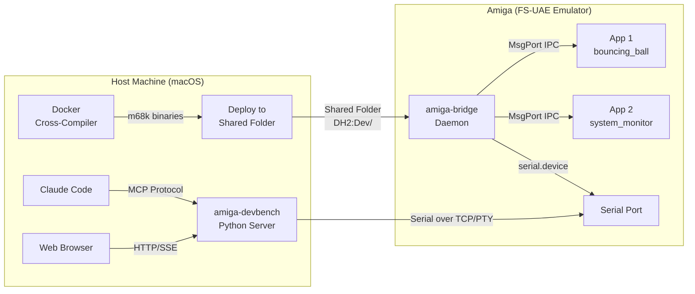

---

## System Architecture

### High-Level Data Flow

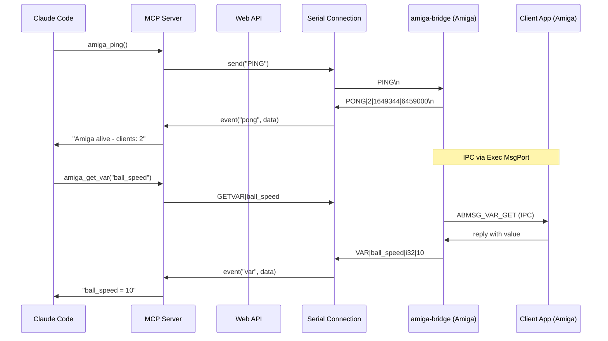

### Component Layers

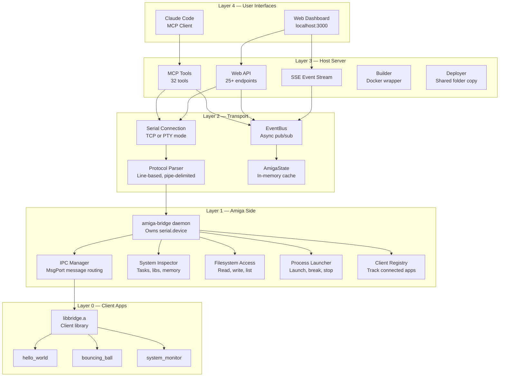

### Amiga-Side IPC Architecture

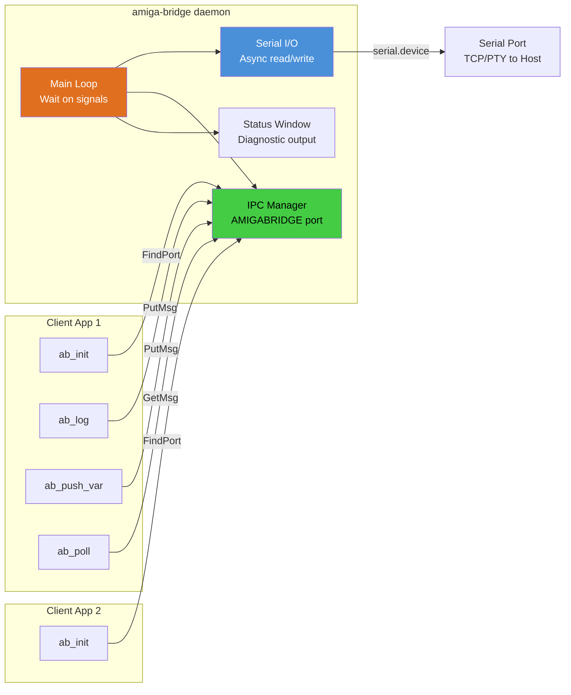

The daemon owns the serial port exclusively. Client apps never touch serial —
they communicate via AmigaOS MsgPort IPC (`FindPort("AMIGABRIDGE")` + `PutMsg/GetMsg`).

---

## Component Deep Dives

### amiga-bridge (Amiga Daemon)

The heart of the Amiga side. A single process that:

1. **Opens serial.device** with async I/O (SendIO/CheckIO) for non-blocking reads
2. **Creates MsgPort "AMIGABRIDGE"** for client app registration
3. **Runs a Wait() loop** on serial + IPC + window signals
4. **Routes messages** between serial (host) and IPC (client apps)
5. **Provides system inspection** without requiring a client app (task list, memory, etc.)

| Source File | Responsibility |
|---|---|
| `main.c` | Event loop, status window, signal handling |
| `serial_io.c` | serial.device open/close, async read/write |
| `ipc_manager.c` | MsgPort creation, message routing |
| `client_registry.c` | Track active clients by name/ID |
| `protocol_handler.c` | Parse host commands, format responses (~1400 lines) |
| `system_inspector.c` | Task/lib/device/volume listing, memory inspection |
| `fs_access.c` | Directory listing, file read/write |
| `process_launcher.c` | Launch processes (async), path validation, CTRL-C |

**Key design decisions:**

- All large buffers are `static` to avoid 4KB default stack overflow
- Uses `Forbid()/Permit()` for task list iteration (minimal critical sections)
- Volatile byte-by-byte reads for memory inspection (CopyMem returns zeros in FS-UAE for some regions)
- Process launcher validates path with `Lock()` before launch, suppresses requesters with `pr_WindowPtr = -1`
- Custom chip registers ($DFF000) blocked from reads (byte access corrupts word-only registers)

### amiga-devbench (Host Server)

A single Python application that combines:

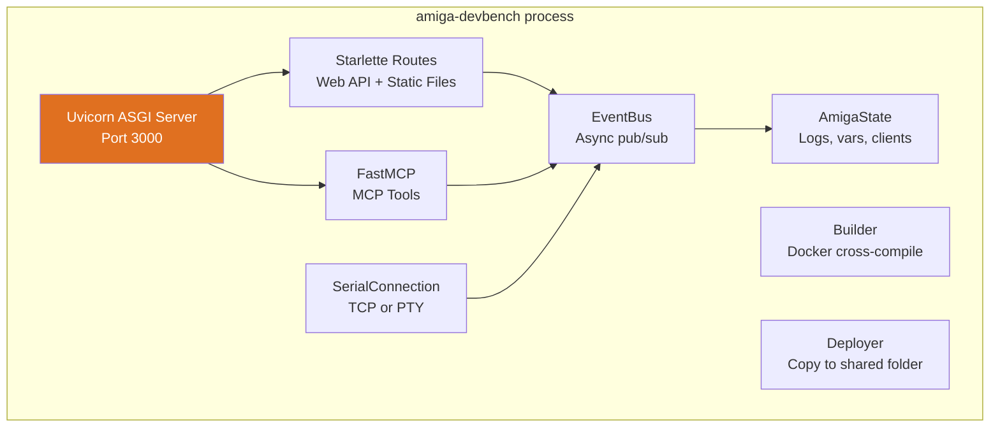

#### UI

#### Dashboard
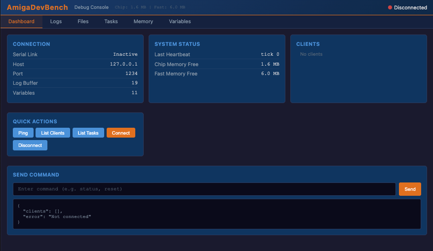

#### Logs

These logs from the amiga are transmitted over the bridge to the host

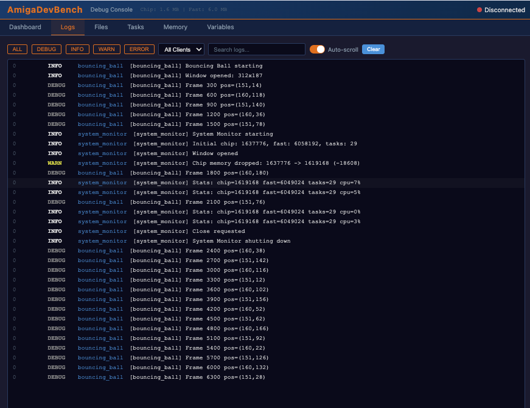

#### Files

You can traverse the file system on the amiga from the host

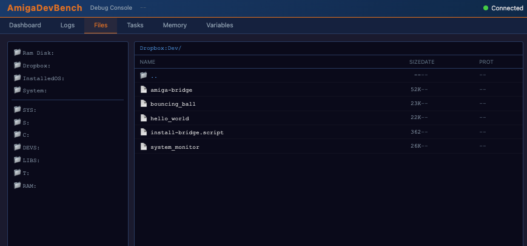

#### Tasks

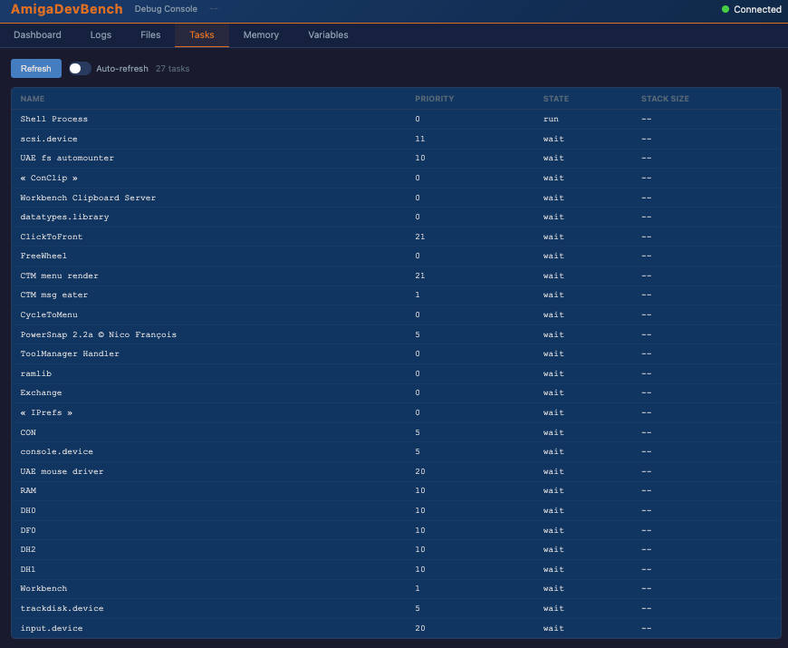

#### Launching an app from the host on the amiga and setting process variables

Using claude and the amiga dev mcp agent 

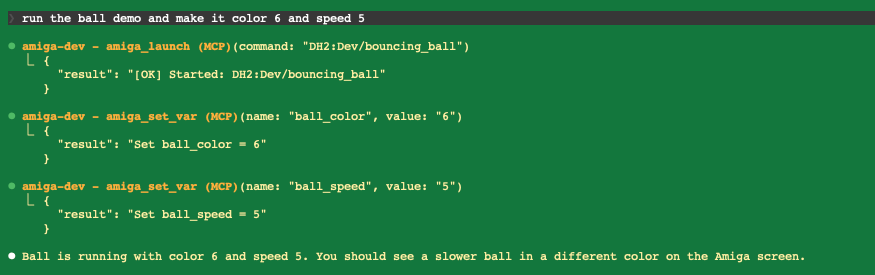

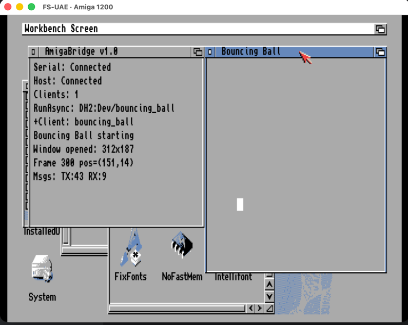

#### Checking out the variables of the running app

Instrumented apps can log to the host over the bridge.  We can also interact with registered process variables (both read and write):

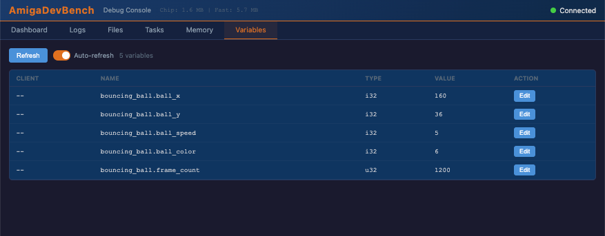

#### Memory editor

Read and write to amiga memory from the host.

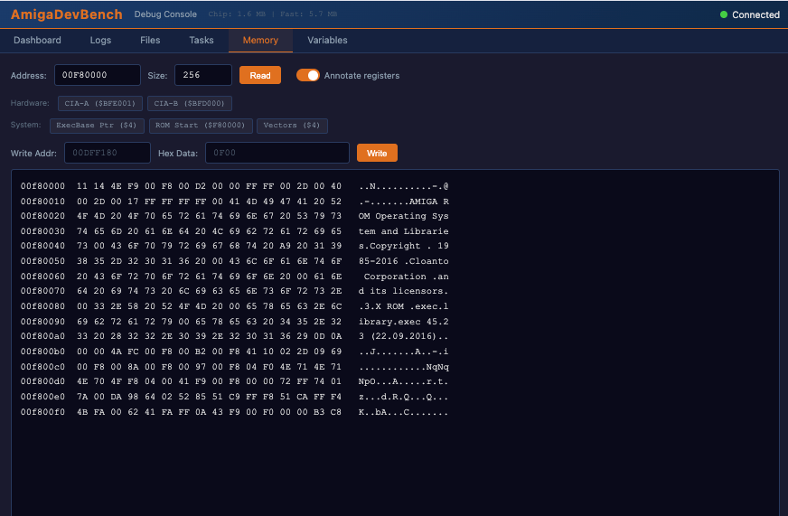


| Module | Purpose |
|---|---|
| `server.py` | Starlette app, all HTTP/SSE endpoints, PID file singleton |
| `mcp_tools.py` | 32 MCP tool definitions using FastMCP |
| `protocol.py` | `parse_message()` and `format_command()` — protocol codec |
| `serial_conn.py` | `SerialConnection` class — PTY creation, TCP connect, auto-reconnect |
| `state.py` | `AmigaState` (log buffer, var cache) + `EventBus` (async queue-based pub/sub) |
| `builder.py` | `Builder` class — wraps `docker run` for cross-compilation |
| `deployer.py` | `Deployer` class — copies binaries to AmiKit shared folder |
| `simulator.py` | Fake Amiga that speaks the bridge protocol (for testing without emulator) |
| `__main__.py` | CLI entry point with argparse |

**Connection modes:**

- **PTY mode** (default): Creates a pseudo-terminal at `/tmp/amiga-serial`, FS-UAE opens it as its serial port
- **TCP mode** (`--serial-host`): Connects to FS-UAE's TCP serial port (e.g., `tcp://0.0.0.0:1234`)

### libbridge.a (Client Library)

Static library that Amiga apps link against. Provides a simple API for:

- Registering with the daemon
- Logging (printf-style, 4 severity levels)
- Registering variables for remote inspection/modification
- Registering hooks (functions the host can call)
- Registering memory regions (named areas the host can read)
- Polling for incoming commands
- Sending heartbeats

**Resource limits per client:** 32 variables, 16 hooks, 8 memory regions

**Message pool:** 4 pre-allocated `BridgeMsg` structures (no malloc per call)

---

## Build Toolchain

### Cross-Compilation via Docker

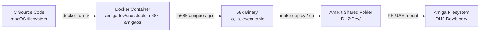

**Docker image:** `amigadev/crosstools:m68k-amigaos`
- Debian-based with `m68k-amigaos-gcc` cross-compiler
- Includes AmigaOS headers and amiga.lib
- Mounted project root as `/work`

**Compiler flags:**

| Flag | Purpose |
|---|---|
| `-noixemul` | No Unix emulation — pure AmigaOS (mandatory) |
| `-m68020` | Target 68020 CPU (A1200 default) |
| `-O0` | No optimization (easier debugging) |
| `-Wall` | All warnings |
| `-Iinclude` | Bridge header path |
| `-lbridge` | Link client library |
| `-lamiga` | Link amiga.lib |

**Build commands:**

```bash
make all          # Build everything (lib + bridge + examples)
make bridge       # Build daemon + libbridge.a
make examples     # Build hello_world, bouncing_ball, system_monitor
make clean        # Clean all artifacts
```

### Deploy Path

Host path:
```
/Applications/AmiKit.app/Contents/SharedSupport/prefix/drive_c/AmiKit/Dropbox/Dev/
```

Amiga path:
```
DH2:Dev/
```

Binaries are copied to the host path and immediately visible on the Amiga via
the FS-UAE shared folder mount.

---

## FS-UAE Emulator Setup

### Configuration File

**Location:** `~/Documents/FS-UAE/Configurations/AmiKit-Debug.fs-uae`

```ini
[fs-uae]
# Kickstart ROM
kickstart_file = ~/Documents/FS-UAE/Kickstarts/kick.rom

# Hardware: A1200 with 68020+FPU, 2MB chip, 8MB fast
amiga_model = A1200
cpu = 68020
fpu = 68882
chip_memory = 2048
fast_memory = 8192

# Hard drives
hard_drive_0 = ~/Documents/FS-UAE/Hard Drives/System     # DH0: (boot)
hard_drive_1 = .../AmiKit/RabbitHole/InstalledOS          # DH1: (OS extras)
hard_drive_2 = .../AmiKit/Dropbox                         # DH2: (Dev binaries)

# Serial: TCP mode (devbench connects as client)
serial_port = tcp://0.0.0.0:1234
serial_on_demand = false

# Mouse: don't capture
mouse_integration = 1
automatic_input_grab = 0
initial_input_grab = 0
cursor_integration = 1

# Networking
bsdsocket_library = 1
```

### Startup Sequence

**Location:** `~/Documents/FS-UAE/Hard Drives/System/S/Startup-Sequence`

Key additions for the development environment:

```
; Suppress "Please insert Work" requester
Assign >NIL: Work: RAM:

; Auto-start bridge daemon
If EXISTS DH2:Dev/amiga-bridge
  Run >NIL: DH2:Dev/amiga-bridge
EndIf
```

### Connection Modes

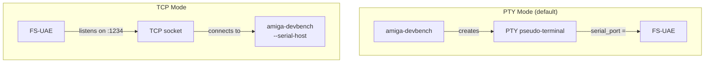

**PTY mode:** devbench must start before FS-UAE (creates the PTY file)
**TCP mode:** FS-UAE must start before devbench (listens on port)

---

## Bridge Protocol

Line-based text protocol over serial. Each message is `\n`-terminated,
fields are pipe-delimited (`|`), maximum 1024 characters per line.

### Amiga → Host Messages

#### Logging & Status
| Message | Format | Description |
|---|---|---|
| LOG | `LOG\|level\|tick\|message` | App log (level: D/I/W/E) |
| CLOG | `CLOG\|client\|level\|tick\|message` | Client-attributed log |
| HB | `HB\|tick\|freeChip\|freeFast` | Heartbeat |
| PONG | `PONG\|clientCount\|freeChip\|freeFast` | Ping response |
| READY | `READY\|version` | Daemon startup |

#### Variables
| Message | Format | Description |
|---|---|---|
| VAR | `VAR\|name\|type\|value` | Variable value (type: i32/u32/str/f32/ptr) |
| CVAR | `CVAR\|client\|name\|type\|value` | Client-attributed variable |

#### Memory
| Message | Format | Description |
|---|---|---|
| MEM | `MEM\|addr_hex\|size\|hex_data` | Memory dump response |

#### System Info
| Message | Format | Description |
|---|---|---|
| CLIENTS | `CLIENTS\|count\|name1,name2,...` | Connected clients |
| TASKS | `TASKS\|count\|name(pri,state,type),...` | Task list |
| LIBS | `LIBS\|count\|name(v.r),...` | Library list |
| DEVICES | `DEVICES\|count\|name(v.r),...` | Device list |
| VOLUMES | `VOLUMES\|count\|name1,name2,...` | Volume list |

#### Files
| Message | Format | Description |
|---|---|---|
| DIR | `DIR\|path\|count\|name(size,type),...` | Directory listing |
| FILE | `FILE\|path\|size\|offset\|hex_data` | File content |
| FILEINFO | `FILEINFO\|path\|size\|date\|protbits` | File metadata |

#### Process & Commands
| Message | Format | Description |
|---|---|---|
| PROC | `PROC\|id\|status\|output` | Process completion |
| CMD | `CMD\|id\|status\|response` | Command response |

#### Client Introspection
| Message | Format | Description |
|---|---|---|
| HOOKS | `HOOKS\|client\|count\|name:desc,...` | Hook list |
| MEMREGS | `MEMREGS\|client\|count\|name:addr:size:desc,...` | Memory regions |
| CINFO | `CINFO\|name\|id\|msgs\|vars:...\|hooks:...\|memregs:...` | Full client info |

#### Acknowledgements
| Message | Format | Description |
|---|---|---|
| OK | `OK\|context\|detail` | Success |
| ERR | `ERR\|context\|detail` | Error |

### Host → Amiga Commands

#### Connection
| Command | Format | Description |
|---|---|---|
| PING | `PING` | Request status |
| SHUTDOWN | `SHUTDOWN` | Terminate daemon |

#### Variables
| Command | Format | Description |
|---|---|---|
| GETVAR | `GETVAR\|name` | Get variable value |
| SETVAR | `SETVAR\|name\|value` | Set variable value |

#### Memory
| Command | Format | Description |
|---|---|---|
| INSPECT | `INSPECT\|addr_hex\|size` | Request memory dump |
| WRITEMEM | `WRITEMEM\|addr_hex\|hex_data` | Write to memory |

#### System Queries
| Command | Format | Description |
|---|---|---|
| LISTCLIENTS | `LISTCLIENTS` | List clients |
| LISTTASKS | `LISTTASKS` | List tasks |
| LISTLIBS | `LISTLIBS` | List libraries |
| LISTDEVS | `LISTDEVS` | List devices |
| LISTVOLUMES | `LISTVOLUMES` | List volumes |

#### Filesystem
| Command | Format | Description |
|---|---|---|
| LISTDIR | `LISTDIR\|path` | List directory |
| READFILE | `READFILE\|path\|offset\|size` | Read file |
| WRITEFILE | `WRITEFILE\|path\|offset\|hex_data` | Write file |
| FILEINFO | `FILEINFO\|path` | Get file info |
| DELETEFILE | `DELETEFILE\|path` | Delete file |
| MAKEDIR | `MAKEDIR\|path` | Create directory |

#### Process Control
| Command | Format | Description |
|---|---|---|
| LAUNCH | `LAUNCH\|id\|command` | Run and wait |
| RUN | `RUN\|id\|command` | Run async |
| DOSCOMMAND | `DOSCOMMAND\|id\|command` | Run AmigaDOS command |
| BREAK | `BREAK\|task_name` | Send CTRL-C |
| SCRIPT | `SCRIPT\|id\|script_text` | Execute script (newlines → `;`) |
| STOP | `STOP\|client_name` | Stop client (CTRL-C + IPC shutdown) |

#### Hooks & Memory Regions
| Command | Format | Description |
|---|---|---|
| LISTHOOKS | `LISTHOOKS\|client` | List hooks |
| CALLHOOK | `CALLHOOK\|id\|client\|hook\|args` | Call hook |
| LISTMEMREGS | `LISTMEMREGS\|client` | List memory regions |
| READMEMREG | `READMEMREG\|client\|region` | Read region |
| CLIENTINFO | `CLIENTINFO\|client` | Get client details |

---

## Client Library API

### Header: `bridge_client.h`

```c
#include "bridge_client.h"
```

### Variable Types

```c
#define AB_TYPE_I32  0   /* signed 32-bit integer */
#define AB_TYPE_U32  1   /* unsigned 32-bit integer */
#define AB_TYPE_STR  2   /* null-terminated string */
#define AB_TYPE_F32  3   /* 32-bit float */
#define AB_TYPE_PTR  4   /* pointer (displayed as hex) */
```

### Functions

#### Initialization
```c
int  ab_init(const char *appName);   /* Returns 0 on success, -1 on failure */
void ab_cleanup(void);               /* Unregister from daemon */
BOOL ab_is_connected(void);          /* Check daemon connection */
```

#### Logging
```c
void ab_log(int level, const char *fmt, ...);   /* Printf-style */

/* Convenience macros */
AB_D(fmt, ...)   /* DEBUG */
AB_I(fmt, ...)   /* INFO */
AB_W(fmt, ...)   /* WARN */
AB_E(fmt, ...)   /* ERROR */
```

#### Variables
```c
void ab_register_var(const char *name, int type, void *ptr);
void ab_unregister_var(const char *name);
void ab_push_var(const char *name);   /* Send current value to host */
```

#### Heartbeat & Memory
```c
void ab_heartbeat(void);                      /* Send status pulse */
void ab_send_mem(APTR addr, ULONG size);      /* Dump memory to host */
```

#### Command Handling
```c
typedef void (*ab_cmd_handler_t)(ULONG id, const char *data);
void ab_set_cmd_handler(ab_cmd_handler_t handler);
void ab_poll(void);                            /* Check for commands (non-blocking) */
void ab_cmd_respond(ULONG id, const char *status, const char *data);
```

#### Hooks (Host-Callable Functions)
```c
typedef int (*ab_hook_fn_t)(const char *args, char *resultBuf, int bufSize);
void ab_register_hook(const char *name, const char *description, ab_hook_fn_t fn);
void ab_unregister_hook(const char *name);
```

#### Memory Regions
```c
void ab_register_memregion(const char *name, APTR addr, ULONG size,
                           const char *description);
void ab_unregister_memregion(const char *name);
```

---

## Programming Examples

### Minimal App — Hello World

```c
#include <proto/exec.h>
#include <proto/dos.h>
#include "bridge_client.h"

int main(void)
{
    if (ab_init("hello") != 0) {
        printf("Bridge not running\n");
        return 1;
    }

    AB_I("Hello from Amiga!");
    Delay(50);
    ab_cleanup();
    return 0;
}
```

**Build:** Link with `-lbridge -lamiga`

### Variables — Remote Monitoring

```c
#include <proto/exec.h>
#include <proto/dos.h>
#include "bridge_client.h"

static LONG score = 0;
static LONG lives = 3;
static char player_name[32] = "Player1";

int main(void)
{
    ab_init("game");

    /* Register variables — host can read and write these */
    ab_register_var("score", AB_TYPE_I32, &score);
    ab_register_var("lives", AB_TYPE_I32, &lives);
    ab_register_var("player_name", AB_TYPE_STR, player_name);

    while (lives > 0) {
        score += 10;

        /* Push updated values to host every 50 frames */
        if (score % 500 == 0) {
            ab_push_var("score");
            ab_push_var("lives");
            ab_heartbeat();
        }

        /* Check for host commands (GETVAR, SETVAR, etc.) */
        ab_poll();

        Delay(1);
    }

    AB_I("Game over! Score: %ld", (long)score);
    ab_cleanup();
    return 0;
}
```

The host can now:
- Read `score` with `GETVAR|score`
- Set `lives` with `SETVAR|lives|99`
- See values in the web dashboard or via MCP tools

### Hooks — Remote Function Calls

```c
#include <proto/exec.h>
#include <proto/dos.h>
#include "bridge_client.h"

static LONG difficulty = 1;

/* Hook: called by the host, runs on the Amiga */
static int hook_set_difficulty(const char *args, char *result, int bufSize)
{
    if (args && args[0]) {
        difficulty = strtol(args, NULL, 10);
        sprintf(result, "Difficulty set to %ld", (long)difficulty);
    } else {
        sprintf(result, "Current difficulty: %ld", (long)difficulty);
    }
    return 0;  /* 0 = success */
}

static int hook_reset(const char *args, char *result, int bufSize)
{
    difficulty = 1;
    strncpy(result, "Reset complete", bufSize - 1);
    return 0;
}

int main(void)
{
    BOOL running = TRUE;
    ab_init("game");

    ab_register_var("difficulty", AB_TYPE_I32, &difficulty);

    /* Register hooks — host can call these by name */
    ab_register_hook("set_difficulty",
                     "Set game difficulty (1-10)",
                     hook_set_difficulty);
    ab_register_hook("reset",
                     "Reset all settings",
                     hook_reset);

    while (running) {
        /* IMPORTANT: Do NOT call ab_log inside hooks!
         * The daemon is waiting for the hook reply. */
        ab_poll();

        if (SetSignal(0L, SIGBREAKF_CTRL_C) & SIGBREAKF_CTRL_C)
            running = FALSE;

        Delay(5);
    }

    ab_cleanup();
    return 0;
}
```

From Claude Code: `amiga_call_hook("game", "set_difficulty", "5")`
From Web UI: Hooks panel → Call

### Memory Regions — Named Memory Areas

```c
#include <proto/exec.h>
#include "bridge_client.h"

struct GameState {
    LONG x, y;
    LONG vx, vy;
    LONG score;
    LONG level;
};

static struct GameState state = {100, 50, 2, 1, 0, 1};

int main(void)
{
    ab_init("game");

    /* Register a named memory region the host can inspect */
    ab_register_memregion("gamestate",
                          &state, sizeof(state),
                          "Player position, velocity, score, level");

    /* ... game loop ... */

    ab_cleanup();
    return 0;
}
```

The host can read the raw bytes of `gamestate` at any time for low-level inspection.

### Full Example — Bouncing Ball (excerpts)

```c
/* Register settable variables */
static LONG ball_speed = 1;
static LONG ball_color = 3;

ab_register_var("ball_speed", AB_TYPE_I32, &ball_speed);
ab_register_var("ball_color", AB_TYPE_I32, &ball_color);

/* Main loop uses the variables */
while (running) {
    draw_ball(rp, ball_x, ball_y, (UBYTE)ball_color);
    ball_x += dx;
    ball_y += dy;

    /* Push updates periodically */
    if (frame_count % 60 == 0) {
        ab_push_var("ball_speed");
        ab_push_var("ball_color");
        ab_heartbeat();
    }

    ab_poll();  /* Always poll! */
    Delay(ball_speed < 1 ? 1 : ball_speed);
}
```

Change the ball color from the web UI by editing `ball_color`, or from
Claude Code with `amiga_set_var("ball_color", "1")`.

### AmigaOS C Gotchas

| Gotcha | Fix |
|---|---|
| `sprintf` returns `char*`, not `int` | Use `strlen()` after if you need length |
| `%d` reads 16-bit WORD | Always use `%ld` with `(long)` cast |
| `%x` reads 16-bit WORD | Always use `%lx` with `(unsigned long)` cast |
| `%c` misaligns stack | Use `%s` with a 2-char string buffer |
| Default stack is 4KB | Make large buffers `static` |
| No memory protection | Buffer overflow crashes the entire OS |
| `Forbid()/Permit()` imbalance | Freezes system permanently |
| `WaitPort()` blocks forever | Use polling with timeout instead |

---

## MCP Tools Reference

All tools are available through Claude Code when connected to the MCP server.

### Build & Deployment

| Tool | Parameters | Description |
|---|---|---|
| `amiga_build` | `project?` | Cross-compile via Docker. Omit project for all. |
| `amiga_clean` | `project?` | Clean build artifacts |
| `amiga_deploy` | `project?` | Copy binaries to AmiKit shared folder |
| `amiga_build_deploy_run` | `project`, `command?` | Build → deploy → launch in one step |

### Connection & Status

| Tool | Parameters | Description |
|---|---|---|
| `amiga_connect` | `mode?`, `host?`, `port?`, `pty_path?` | Connect to Amiga (TCP or PTY) |
| `amiga_disconnect` | — | Close serial connection |
| `amiga_ping` | — | Check if Amiga is alive, get client count and memory |

### Logging

| Tool | Parameters | Description |
|---|---|---|
| `amiga_log` | `count?`, `level?` | Get recent log messages |
| `amiga_watch_logs` | `duration_ms?`, `level?` | Stream logs in real-time |
| `amiga_watch_status` | `duration_ms?` | Stream heartbeats and variable updates |

### Memory

| Tool | Parameters | Description |
|---|---|---|
| `amiga_inspect_memory` | `address`, `size` | Hex dump at address (blocks custom chip regs) |
| `amiga_write_memory` | `address`, `hex_data` | Write hex bytes to RAM address |

### Variables

| Tool | Parameters | Description |
|---|---|---|
| `amiga_get_var` | `name` | Read a registered variable |
| `amiga_set_var` | `name`, `value` | Write a registered variable |

### Process Control

| Tool | Parameters | Description |
|---|---|---|
| `amiga_launch` | `command` | Launch a program on the Amiga |
| `amiga_dos_command` | `command` | Run an AmigaDOS command |
| `amiga_run_script` | `script` | Execute multi-line AmigaDOS script |
| `amiga_break` | `name` | Send CTRL-C break to a task |
| `amiga_stop_client` | `name` | Gracefully stop a bridge client |

### System Information

| Tool | Parameters | Description |
|---|---|---|
| `amiga_list_clients` | — | List connected bridge clients |
| `amiga_list_tasks` | — | List all running tasks/processes |
| `amiga_list_libs` | — | List loaded libraries with versions |
| `amiga_client_info` | `client` | Detailed info: vars, hooks, memregs |

### Filesystem

| Tool | Parameters | Description |
|---|---|---|
| `amiga_list_dir` | `path?` | List directory contents |
| `amiga_read_file` | `path`, `offset?`, `size?` | Read file content (hex) |
| `amiga_write_file` | `path`, `offset`, `hex_data` | Write hex data to file |

### Hooks & Memory Regions

| Tool | Parameters | Description |
|---|---|---|
| `amiga_list_hooks` | `client?` | List registered hooks |
| `amiga_call_hook` | `client`, `hook`, `args?` | Call a hook function remotely |
| `amiga_list_memregions` | `client?` | List registered memory regions |
| `amiga_read_memregion` | `client`, `region` | Read a named memory region |

### Execution

| Tool | Parameters | Description |
|---|---|---|
| `amiga_exec` | `command` | Send expression to client's command handler |

### Graphics & Hardware Inspection

| Tool | Parameters | Description |
|---|---|---|
| `amiga_screenshot` | `window?` | Capture screen or window as PNG (planar→chunky conversion) |
| `amiga_get_palette` | `screen?` | Read OCS/ECS 12-bit color palette via GetRGB4() |
| `amiga_set_palette` | `index`, `r`, `g`, `b` | Set a palette color (4-bit per channel) |
| `amiga_copper_list` | — | Read and decode copper list (MOVE/WAIT/SKIP instructions) |
| `amiga_sprites` | — | Read 8 hardware sprite channels (copper + SimpleSprites) |
| `amiga_disassemble` | `address`, `count?` | Disassemble 68k code with LVO annotation |
| `amiga_last_crash` | — | Read last crash report (registers, stack, alert code) |

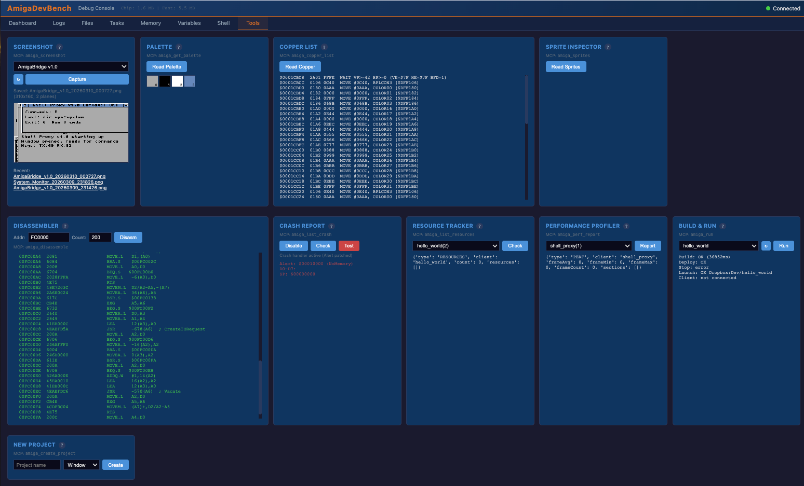
### Client Profiling

| Tool | Parameters | Description |
|---|---|---|
| `amiga_list_resources` | `client` | Query client resource tracking (alloc/free, open/close) |
| `amiga_perf_report` | `client` | Query client performance data (frame timing, sections) |

### Project Scaffolding

| Tool | Parameters | Description |
|---|---|---|
| `amiga_create_project` | `name`, `template?` | Create new example project (window/screen/headless) |
| `amiga_run` | `project`, `command?` | Deploy and launch (skip build) |

---

## Web UI Reference

The web dashboard at `http://localhost:3000/` provides a real-time view
of the Amiga system.

### Panels

#### Connection Status (Header)
- Serial link state (connected/disconnected)
- Host, port, mode (TCP/PTY)
- Log count, variable count
- Last heartbeat timestamp

#### Logs Panel
- Real-time log stream via SSE
- Filter by level: DEBUG, INFO, WARN, ERROR (toggleable buttons)
- Filter by client name (dropdown)
- Text search (substring match)
- Auto-scroll toggle
- Clear button
- Color-coded by severity (blue=debug, green=info, orange=warn, red=error)

#### Files Panel
- Volume browser (left pane) — click to navigate
- File listing (right pane) — name, size, date, protection bits
- Breadcrumb path navigation

#### Tasks Panel
- All running tasks/processes
- Columns: Name, Priority, State (run/ready/wait), Type (proc/task)
- Refresh button + auto-refresh toggle (5-second interval)

#### Memory Panel
- Address input (hex) + Size input (decimal)
- Read button — fetches hex dump
- Bookmarks: CIA-A ($BFE001), CIA-B ($BFD000), ExecBase ($4), ROM ($F80000), Vectors ($4)
- Hex dump display with ASCII annotation
- **Write controls:** Address input, Hex Data input, Write button
- Write status indicator

#### Variables Panel
- All registered variables from all clients
- Columns: Client, Name, Type, Value, Action
- Inline edit — click Edit, type new value, press Enter or click Set
- Auto-refresh toggle (3-second interval via SSE + polling)
- Auto-refresh pauses while editing to prevent input clobbering

#### Shell Tab
Remote AmigaDOS shell via the `shell_proxy` bridge client.

- **Launch Shell Proxy** button — builds, deploys, and starts the shell proxy on the Amiga
- Terminal-style interface with scrolling output (green text on dark background)
- Type AmigaDOS commands (`dir`, `type`, `list`, `assign`, etc.) and see output in real-time
- Commands execute on the Amiga via the bridge protocol, output streams back over serial
- Status indicator shows connection state
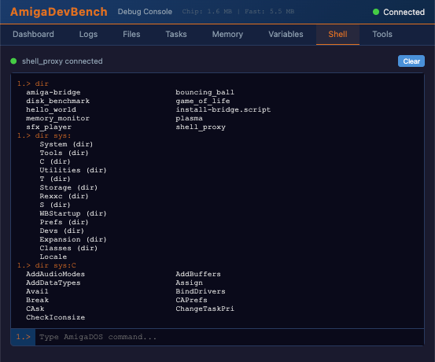
#### Tools Tab
Visual inspection and development tools arranged in a grid. Each tool has a `?` tooltip with detailed help.

**Screenshot** — Captures the Amiga display as PNG. Select a window from the dropdown or choose "Whole Screen" for the frontmost screen. Reads planar bitplane data from chip RAM and converts to chunky pixels on the host. Screenshots saved to `/tmp/amiga-screenshots/` with clickable preview links and history.

**Palette** — Reads the OCS/ECS 12-bit color palette from the frontmost screen's ColorMap via `GetRGB4()`. Displays color swatches with hex values. Workbench uses 4 colors; custom screens up to 32 (5 bitplanes) or 256 (AGA).

**Copper List** — Reads and decodes the copper list from `GfxBase->ActiView->LOFCprList`. Shows each 4-byte instruction: MOVE (write to custom chip register with named register), WAIT (wait for beam position), or SKIP. Spans 2 grid columns for readability.

**Sprite Inspector** — Reads the 8 hardware sprite channels by scanning the copper list for SPRxPT register writes and checking `GfxBase->SimpleSprites[]` for Intuition-managed sprites (mouse pointer). Shows position, size, and attach mode.

**Disassembler** — Reads memory from the Amiga and disassembles 68000 machine code. Enter a hex address and instruction count. Supports all 68k addressing modes and annotates known Exec/DOS/Intuition/Graphics library calls (LVOs). Spans 2 grid columns. Try `$FC0000` for Kickstart ROM.

**Crash Report** — Intercepts guru meditations by patching `exec.library Alert()` via `SetFunction()`. Not installed by default — click **Enable** to activate, **Disable** to remove. When a crash occurs, captures alert code, alert name, all 16 registers (D0-D7, A0-A7), stack pointer, and 64 bytes of stack data. Click **Test** to trigger a recoverable alert.

**Resource Tracker** — Queries a bridge client's tracked resources. Select a client from the dropdown. Apps using `ab_track_alloc()`/`ab_track_free()` and `ab_track_open()`/`ab_track_close()` report allocations and open handles. Shows leaked resources.

**Performance Profiler** — Queries a bridge client's performance data. Select a client from the dropdown. `ab_perf_frame_start()`/`ab_perf_frame_end()` tracks frame timing (avg/min/max). `ab_perf_section_start()`/`ab_perf_section_end()` measures named code sections. Uses `VHPOSR ($DFF006)` for ~64us precision.

**Build & Run** — Full development cycle in one click: cross-compile via Docker, deploy binary to AmiKit shared folder, stop any running instance (CTRL-C), then launch. Select a project from the dropdown (populated from the `examples/` directory).

**New Project** — Scaffolds a new example project with Makefile and main.c. Three templates:
- **Window** — Intuition window on the Workbench screen with bridge integration
- **Screen** — Custom screen (320x256, 5 bitplanes) with bridge integration
- **Headless** — CLI-only program with bridge hooks, no GUI

### SSE Event Stream

The web UI connects to `/api/events` for real-time updates:

| Event | Data | Updates |
|---|---|---|
| `log` | `{level, tick, message, client}` | Logs panel |
| `heartbeat` | `{tick, freeChip, freeFast}` | Status header |
| `var` | `{name, varType, value, client}` | Variables panel |
| `status` | `{connected, logCount, varCount}` | Connection status |
| `clients` | `{names: [...]}` | Client list |
| `tasks` | `{tasks: [...]}` | Tasks panel |
| `connected` | `{}` | Status indicator → green |
| `disconnected` | `{}` | Status indicator → red |

---

## Scripts & Utilities

### `scripts/devbench-start.sh` — Full Environment Launcher

```bash
./scripts/devbench-start.sh            # Start devbench + FS-UAE
./scripts/devbench-start.sh --sim      # Simulator mode (no emulator needed)
./scripts/devbench-start.sh --restart  # Restart FS-UAE only
./scripts/devbench-start.sh --stop     # Stop everything
./scripts/devbench-start.sh --status   # Show running status
```

Manages PID files in `/tmp/amiga-dev/`, waits for HTTP health check before
launching FS-UAE, cleans up stale processes.

### Other Scripts

| Script | Purpose |
|---|---|
| `scripts/start-all.sh` | Legacy startup (old TypeScript MCP server) |
| `scripts/amiga-serial.py` | Serial port utilities |
| `scripts/amiga-serial-bridge.py` | Standalone TCP-to-serial bridge (obsolete) |
| `scripts/create-pty.py` | Create PTY pair for testing |

### MCP Client Configuration

**`.mcp.json`** (in project root):
```json
{
  "mcpServers": {
    "amiga-dev": {
      "type": "streamable-http",
      "url": "http://localhost:3000/mcp"
    }
  }
}
```

This auto-configures Claude Code to connect to the MCP server when
working in this project directory.

---

## Future Improvements

### Debugging & Inspection

- **Source-level debugging**: Map addresses to C source lines using DWARF/STABS debug info from the cross-compiler. Show source context in memory inspector.
- **Breakpoint support**: Use 68k TRAP instructions or the ILLEGAL opcode to implement software breakpoints. Bridge daemon could patch/unpatch code at runtime.
- **Stack trace**: Walk the 68k stack frames to produce symbolic backtraces when an app crashes or hits a breakpoint.
- **Watchpoints**: Monitor memory addresses for changes and notify the host when values change (polled or via custom exception handler).

### Build & Workflow

- **Incremental builds**: Cache Docker layers or use a persistent container to avoid pulling the image on every build.
- **Build error parsing**: Parse GCC error output and map to source files on the host for clickable error navigation.
- **Auto-rebuild on save**: Watch source files and trigger build+deploy+relaunch automatically.
- **Multiple target configs**: Support different CPU targets (68000, 68020, 68040) and memory configurations.
- **Unit test framework**: Lightweight test harness that runs on the Amiga and reports results via the bridge.

### Protocol & Communication

- **Binary protocol option**: Replace text protocol with a compact binary format for higher throughput (especially for large memory dumps).
- **Compression**: Compress large transfers (file reads, memory dumps) to reduce serial bandwidth.
- **Flow control**: Implement proper XON/XOFF or hardware flow control for reliability on real hardware.
- **Checksum/CRC**: Add integrity checking for serial data (bit errors on real serial links).
- **Multi-serial**: Support multiple serial connections for parallel debugging of networked Amiga setups.

### Web UI

- **Memory map visualization**: Graphical view of the Amiga memory map showing chip/fast/ROM regions, allocated blocks, and registered memory regions.
- **Variable graphing**: Plot variable values over time (e.g., chart free memory or CPU usage).
- **Custom chip register viewer**: Word-aligned read-only view of specific safe custom chip registers with field-level decoding (e.g., DMACON bits).
- **Sprite editor**: Visual sprite data editor using memory write.
- **Sound register viewer**: Paula chip register inspection for audio debugging.
- **File editor**: Text editor for Amiga files (currently only hex view).
- **Dark/light theme toggle**: Currently dark-only.

### Client Library

- **Automatic variable push**: Option to push all registered variables on every heartbeat without manual `ab_push_var()` calls.
- **Structured logging**: Log with key=value pairs for easier filtering and search on the host.
- **C++ support**: Wrapper classes with RAII for automatic cleanup.
- **Lua/REXX scripting**: Execute scripts on the Amiga that interact with registered variables and hooks.

### Infrastructure

- **Real hardware support**: Test and optimize for real Amiga serial ports (active at 9600-115200 baud) instead of emulator TCP.
- **Network transport**: Optional TCP/IP transport using bsdsocket.library for Amigas with network cards (faster than serial).
- **Multi-client web UI**: Show different clients in separate tabs/panels with independent variable views.
- **Session recording**: Record all bridge traffic for later replay and analysis.
- **CI/CD pipeline**: Automated build + deploy + test cycle triggered by git push.
- **VS Code extension**: Bring the web UI and MCP tools into VS Code as an extension with inline diagnostics.
- **ROM-based bridge**: Burn the bridge daemon into a custom Kickstart ROM module for zero-setup debugging.

### AmigaOS Integration

- **Intuition event forwarding**: Forward mouse clicks and keyboard events from the host to the Amiga (remote control).
- **Clipboard bridge**: Share clipboard between host and Amiga.
- **Assign management**: Create/modify/remove Amiga assigns from the host.
- **Preference editing**: Read and write AmigaOS preference files from the host.
- **Package manager**: Simple system for installing/removing Amiga software via the bridge.
