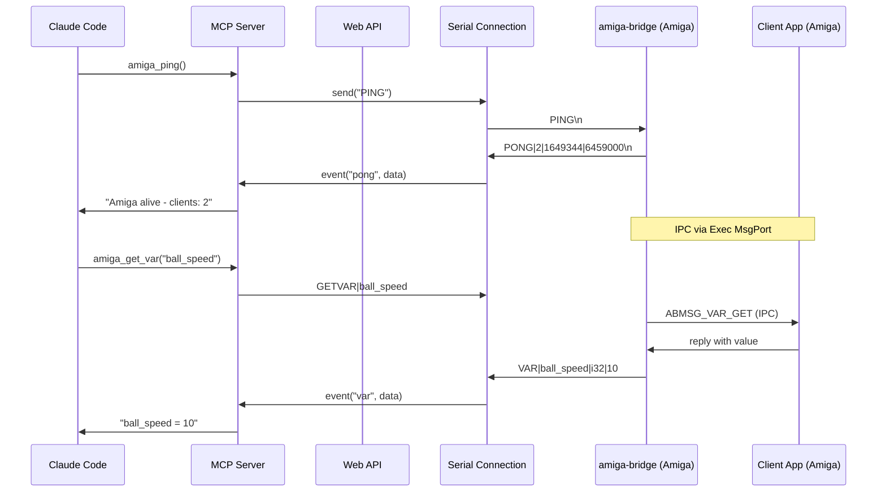
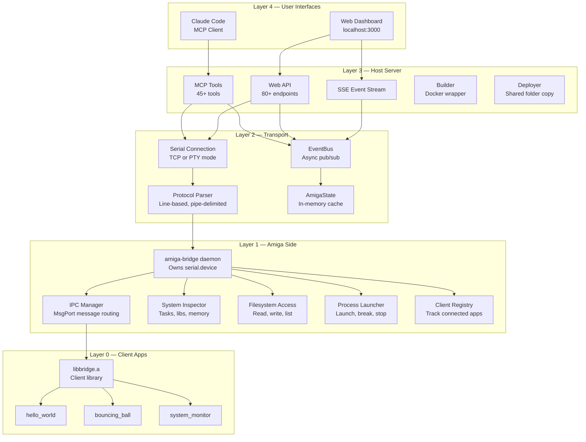
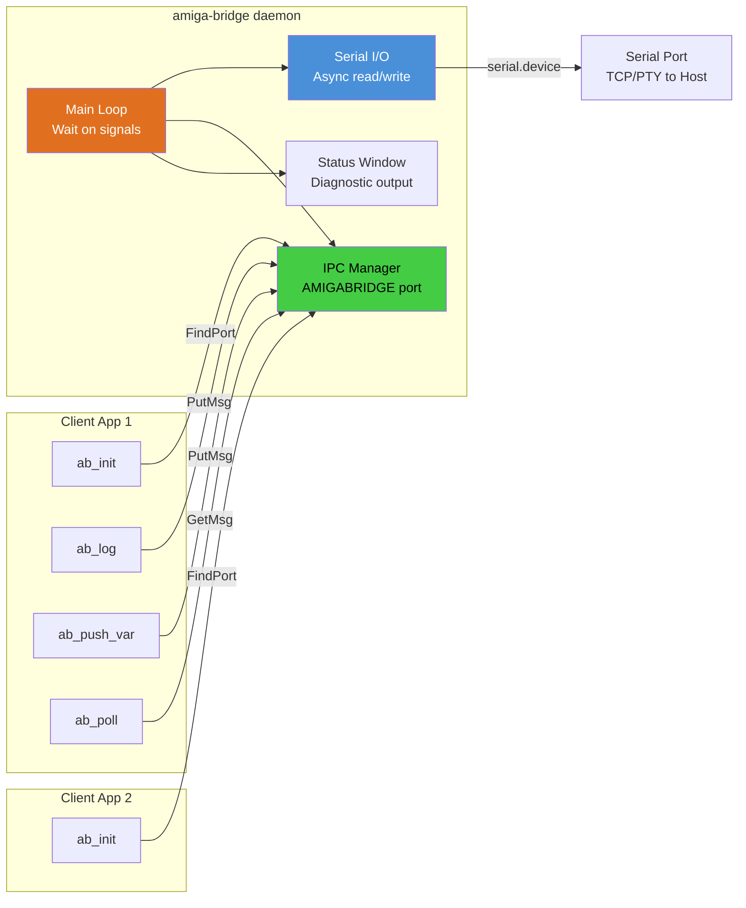
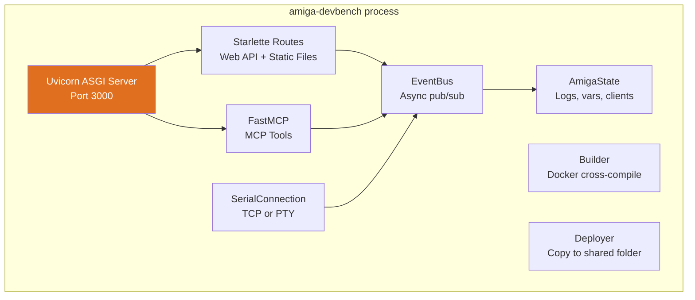

<!-- SPDX-License-Identifier: MIT -->
<!-- Copyright (c) 2026 Chris Collins <chris@hitorro.com> -->

# Architecture

[Documentation index](README.md) · [Install DevBench](quickstart.md)

## System Architecture

### High-Level Data Flow

### Component Layers

### Amiga-Side IPC Architecture

The daemon owns the serial port exclusively. Client apps never touch serial —
they communicate via AmigaOS MsgPort IPC (`FindPort("AMIGABRIDGE")` + `PutMsg/GetMsg`).

---

## Component Deep Dives

### amiga-bridge (Amiga Daemon)

The heart of the Amiga side. A single process that:

1. **Opens serial.device** with async I/O (SendIO/CheckIO) for non-blocking reads
2. **Creates MsgPort "AMIGABRIDGE"** for client app registration
3. **Runs a Wait() loop** on serial + IPC + window signals
4. **Routes messages** between serial (host) and IPC (client apps)
5. **Provides system inspection** without requiring a client app (task list, memory, etc.)

| Source File | Responsibility |
|---|---|
| `main.c` | Event loop, status window, signal handling |
| `serial_io.c` | serial.device open/close, async read/write |
| `ipc_manager.c` | MsgPort creation, message routing |
| `client_registry.c` | Track active clients by name/ID |
| `protocol_handler.c` | Parse host commands, format responses (~1400 lines) |
| `system_inspector.c` | Task/lib/device/volume listing, memory inspection |
| `fs_access.c` | Directory listing, file read/write, rename, copy, protect, comment, checksum (CRC32), append |
| `process_launcher.c` | Launch processes (async), path validation, CTRL-C, process tracking (up to 16), signal delivery |

**Key design decisions:**

- All large buffers are `static` to avoid 4KB default stack overflow
- Uses `Forbid()/Permit()` for task list iteration (minimal critical sections)
- Volatile byte-by-byte reads for memory inspection (CopyMem returns zeros in FS-UAE for some regions)
- Process launcher validates path with `Lock()` before launch, suppresses requesters with `pr_WindowPtr = -1`
- Custom chip registers ($DFF000) blocked from reads (byte access corrupts word-only registers)

### amiga-devbench (Host Server)

A single Python application that combines:

#### UI

See [Web UI Reference](web-ui.md#web-ui-reference) for detailed documentation with screenshots of all 8 tabs.

| Module | Purpose |
|---|---|
| `server.py` | Starlette app, all HTTP/SSE endpoints, PID file singleton |
| `mcp_tools.py` | 45+ MCP tool definitions using FastMCP |
| `protocol.py` | `parse_message()` and `format_command()` — protocol codec |
| `serial_conn.py` | `SerialConnection` class — PTY creation, TCP connect, auto-reconnect |
| `state.py` | `AmigaState` (log buffer, var cache) + `EventBus` (async queue-based pub/sub) |
| `builder.py` | `Builder` class — wraps `docker run` for cross-compilation |
| `deployer.py` | `Deployer` class — copies binaries to AmiKit shared folder |
| `simulator.py` | Fake Amiga that speaks the bridge protocol (for testing without emulator) |
| `__main__.py` | CLI entry point with argparse |

**Connection modes:**

- **PTY mode** (default): Creates a pseudo-terminal at `/tmp/amiga-serial`, FS-UAE opens it as its serial port
- **TCP mode** (`--serial-host`): Connects to FS-UAE's TCP serial port (e.g., `tcp://0.0.0.0:1234`)

### libbridge.a (Client Library)

Static library that Amiga apps link against. Provides a simple API for:

- Registering with the daemon
- Logging (printf-style, 4 severity levels)
- Registering variables for remote inspection/modification
- Registering hooks (functions the host can call)
- Registering memory regions (named areas the host can read)
- Polling for incoming commands
- Sending heartbeats

**Resource limits per client:** 32 variables, 16 hooks, 8 memory regions

**Message pool:** 4 pre-allocated `BridgeMsg` structures (no malloc per call)

---
