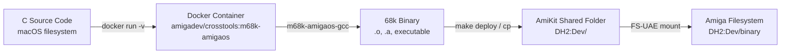

<!-- SPDX-License-Identifier: MIT -->
<!-- Copyright (c) 2026 Chris Collins <chris@hitorro.com> -->

# Build and development reference

[Documentation index](README.md) · [Install DevBench](quickstart.md)

The examples below describe specific setups. For a new installation, start
with the [checkout installation guide](quickstart.md) and use your own paths
and a separate local configuration.

## Build Toolchain

### Cross-Compilation via Docker



**Docker image:** `amigadev/crosstools:m68k-amigaos`
- Debian-based with `m68k-amigaos-gcc` cross-compiler
- Includes AmigaOS headers and amiga.lib
- Mounted project root as `/work`

**Compiler flags:**

| Flag | Purpose |
|---|---|
| `-noixemul` | No Unix emulation — pure AmigaOS (mandatory) |
| `-m68020` | Target 68020 CPU (A1200 default) |
| `-O0` | No optimization (easier debugging) |
| `-Wall` | All warnings |
| `-Iinclude` | Bridge header path |
| `-lbridge` | Link client library |
| `-lamiga` | Link amiga.lib |

**Build commands:**

```bash
make all          # Build everything (lib + bridge + examples)
make bridge       # Build daemon + libbridge.a
make examples     # Build every project under examples/ (auto-discovered)
                  # examples/ is a submodule — run
                  # `git submodule update --init` first if empty
make clean        # Clean all artifacts
```

### Deploy Path

Host path:
```
/Applications/AmiKit.app/Contents/SharedSupport/prefix/drive_c/AmiKit/Dropbox/Dev/
```

Amiga path:
```
DH2:Dev/
```

Binaries are copied to the host path and immediately visible on the Amiga via
the FS-UAE shared folder mount.

---

## Developing Amiga Software with Claude Code

This section explains how the MCP tools, REST API, and web UI work together to create a modern development workflow for the Amiga — all driven from Claude Code on a Mac.

### The Development Loop

The typical cycle when building Amiga software with Claude Code:

1. **Write code** — Claude edits C source files on macOS
2. **Build** — `amiga_build("myproject")` cross-compiles via Docker
3. **Deploy** — `amiga_deploy("myproject")` copies the binary to the shared folder
4. **Run** — `amiga_launch("DH2:Dev/myproject")` starts it on the Amiga
5. **Observe** — `amiga_watch_logs()` streams output, `amiga_get_var()` reads state
6. **Debug** — `amiga_inspect_memory()`, `amiga_last_crash()`, `amiga_disassemble()`
7. **Iterate** — `amiga_stop_client()`, fix code, repeat from step 2

Or in one shot: `amiga_build_deploy_run("myproject")` does steps 2-4 together.

### How Each Tool Category Helps

#### Build & Deploy Tools
Claude can write C code, compile it, and deploy without you ever touching a terminal. The persistent Docker container makes rebuilds fast (~1-2 seconds). `amiga_checksum()` verifies the deployed binary matches what was built — essential when debugging "why isn't my change showing up?" issues.

#### Process Management
After launching a program, Claude can track it with `amiga_proc_list()` and `amiga_proc_stat()`. If a program hangs, `amiga_signal()` sends CTRL-C/D/E/F without needing the Amiga keyboard. `amiga_stop_client()` gracefully shuts down bridge-aware apps. This makes the Amiga act like a headless build target — you never need to interact with the emulator window during normal development.

#### File Operations
Claude can manage the Amiga filesystem directly:
- **`amiga_rename`/`amiga_copy`** — reorganize project files without AmigaDOS commands
- **`amiga_protect`** — set executable/script bits after deploying
- **`amiga_set_comment`** — tag files with version info or build timestamps
- **`amiga_append_file`** — write to log files or config files incrementally
- **`amiga_tail`** — watch a log file in real-time (like `tail -f` on Unix)

These run server-side on the Amiga, avoiding slow serial round-trips for bulk operations.

#### System Inspection
When something goes wrong, Claude can query the Amiga's state comprehensively:
- **`amiga_list_tasks`** — see all running processes, find runaway tasks
- **`amiga_list_libs`** / **`amiga_lib_info`** — check library versions, verify a library loaded
- **`amiga_list_assigns`** / **`amiga_assign`** — manage logical assigns (crucial for AmigaOS path resolution)
- **`amiga_capabilities`** — verify which protocol commands the daemon supports
- **`amiga_inspect_memory`** — read any memory address (chip RAM, fast RAM, ROM)

#### Debugging
The most powerful tools for tracking down bugs:
- **`amiga_last_crash`** — when the dreaded Guru Meditation hits, Claude reads the alert code, all registers, and stack data
- **`amiga_load_symbols`** + **`amiga_lookup_symbol`** — map crash addresses back to C source lines
- **`amiga_disassemble`** — inspect generated 68k code with LVO annotations
- **`amiga_watch_logs`** — stream app debug output in real-time
- **`amiga_get_var`** / **`amiga_set_var`** — read and write instrumented variables while the app runs

#### Remote Control
Claude can interact with the Amiga's GUI without screen access:
- **`amiga_input_key`/`amiga_input_click`/`amiga_input_mouse_move`** — simulate user input
- **`amiga_screenshot`** — see what's on screen
- **`amiga_list_screens`/`amiga_list_screen_windows`** — understand the current UI state

### REST API Endpoints (New)

The web UI and external tools can call these HTTP endpoints directly:

#### Capabilities & Process Management
| Endpoint | Method | Description |
|---|---|---|
| `/api/tools/capabilities` | GET | Query daemon version and supported commands |
| `/api/tools/proclist` | GET | List tracked async processes |
| `/api/tools/signal` | POST | Send signal to tracked process (`id`, `sigType`) |

#### Extended File Operations
| Endpoint | Method | Description |
|---|---|---|
| `/api/tools/checksum` | GET | CRC32 + size for a file (`path`) |
| `/api/tools/protect` | GET/POST | Get or set protection bits (`path`, `bits?`) |
| `/api/tools/rename` | POST | Rename a file (`oldPath`, `newPath`) |
| `/api/tools/copy` | POST | Copy a file server-side (`src`, `dst`) |
| `/api/tools/tail` | GET (SSE) | Stream live file appends (`path`) |

#### Assign Management (Native Protocol)
| Endpoint | Method | Description |
|---|---|---|
| `/api/tools/assigns` | GET | List all DOS assigns (native ASSIGNS command) |
| `/api/tools/assign/set` | POST | Create/replace/add assign (native ASSIGN command) |

### Example: Full Debugging Session

```
You: "My bouncing_ball app crashes after a few seconds"

Claude: [builds and deploys the project]
  amiga_build_deploy_run("bouncing_ball")

Claude: [watches the crash happen]
  amiga_watch_logs(duration_ms=30000)
  → CLOG|bouncing_ball|I|1234|Starting...
  → CLOG|bouncing_ball|I|1567|Frame 100
  → [crash]

Claude: [reads the crash report]
  amiga_last_crash()
  → Alert: 80000004 (Access Fault)
  → PC: 0040A2B8, SR: 0000
  → D0=00000000 A0=DEADBEEF ...

Claude: [maps the crash address to source]
  amiga_load_symbols("bouncing_ball")
  amiga_lookup_symbol("0040A2B8")
  → bouncing_ball.c:142 in draw_ball()

Claude: [inspects the source, finds the bug, fixes it, rebuilds]
  amiga_build_deploy_run("bouncing_ball")
  → Build OK → Deploy OK → Running
```

### Example: File Verification Workflow

```
You: "Deploy my app and verify it's correct"

Claude:
  amiga_build("myapp")
  amiga_deploy("myapp")
  amiga_checksum("DH2:Dev/myapp")
  → CRC32: a1b2c3d4, Size: 12340 bytes

  # Compare with local build
  # CRC matches → deployment verified

  amiga_protect("DH2:Dev/myapp", "00000000")  # Ensure rwed bits set
  amiga_launch("DH2:Dev/myapp")
  amiga_tail("T:myapp.log", duration_ms=5000)  # Watch the log file
```

---

## Scripts & Utilities

### `scripts/devbench-start.sh` — Full Environment Launcher

```bash
./scripts/devbench-start.sh            # Start devbench + FS-UAE
./scripts/devbench-start.sh --sim      # Simulator mode (no emulator needed)
./scripts/devbench-start.sh --restart  # Restart FS-UAE only
./scripts/devbench-start.sh --stop     # Stop everything
./scripts/devbench-start.sh --status   # Show running status
```

Manages PID files in `/tmp/amiga-dev/`, waits for HTTP health check before
launching FS-UAE, cleans up stale processes.

### Other Scripts

| Script | Purpose |
|---|---|
| `scripts/start-all.sh` | Legacy startup (old TypeScript MCP server) |
| `scripts/amiga-serial.py` | Serial port utilities |
| `scripts/amiga-serial-bridge.py` | Standalone TCP-to-serial bridge (obsolete) |
| `scripts/create-pty.py` | Create PTY pair for testing |

### MCP Client Configuration

**`.mcp.json`** (in project root):
```json
{
  "mcpServers": {
    "amiga-dev": {
      "type": "streamable-http",
      "url": "http://localhost:3000/mcp"
    }
  }
}
```

This auto-configures Claude Code to connect to the MCP server when
working in this project directory.

---
