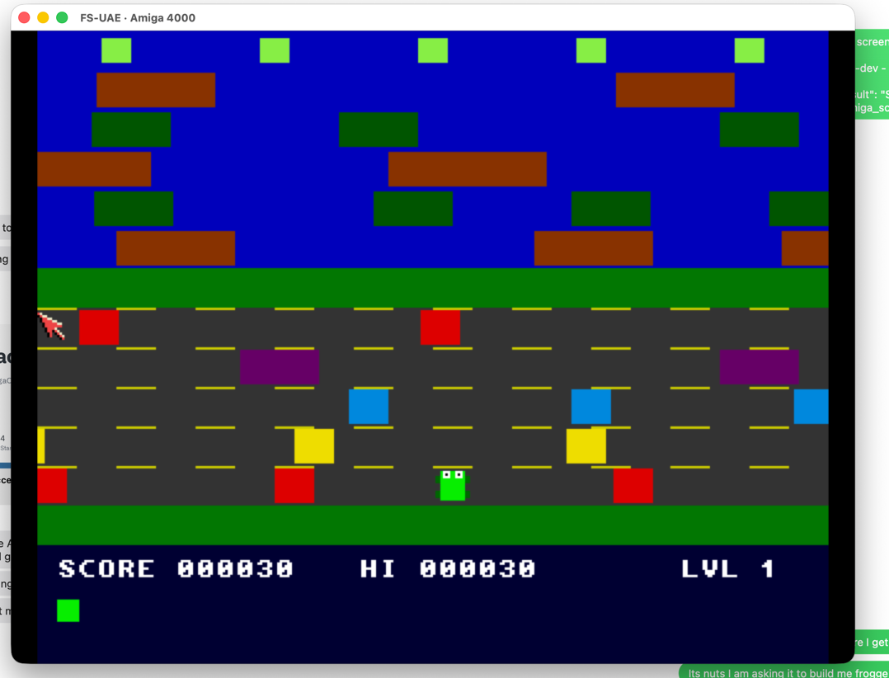
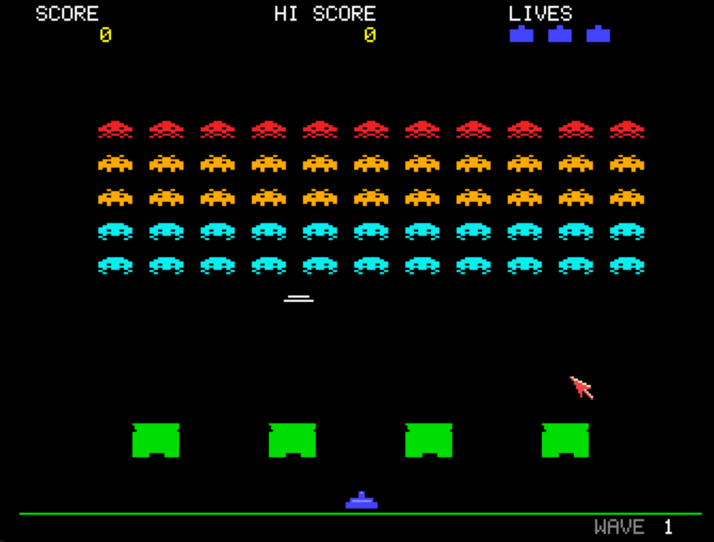
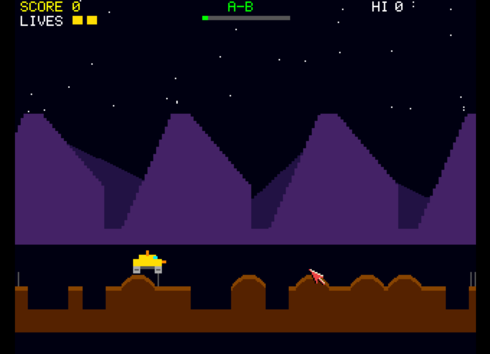
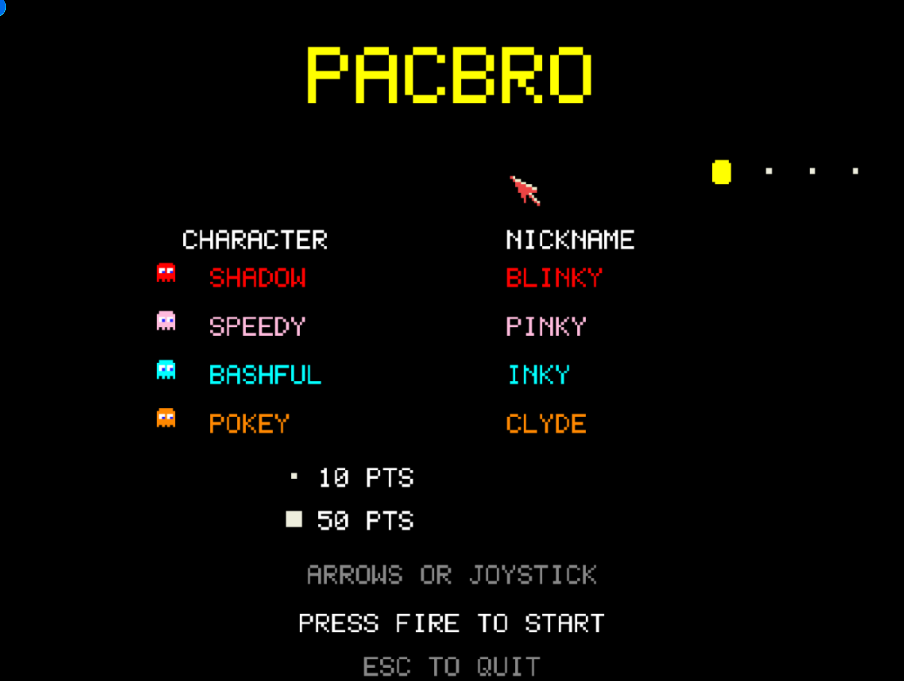
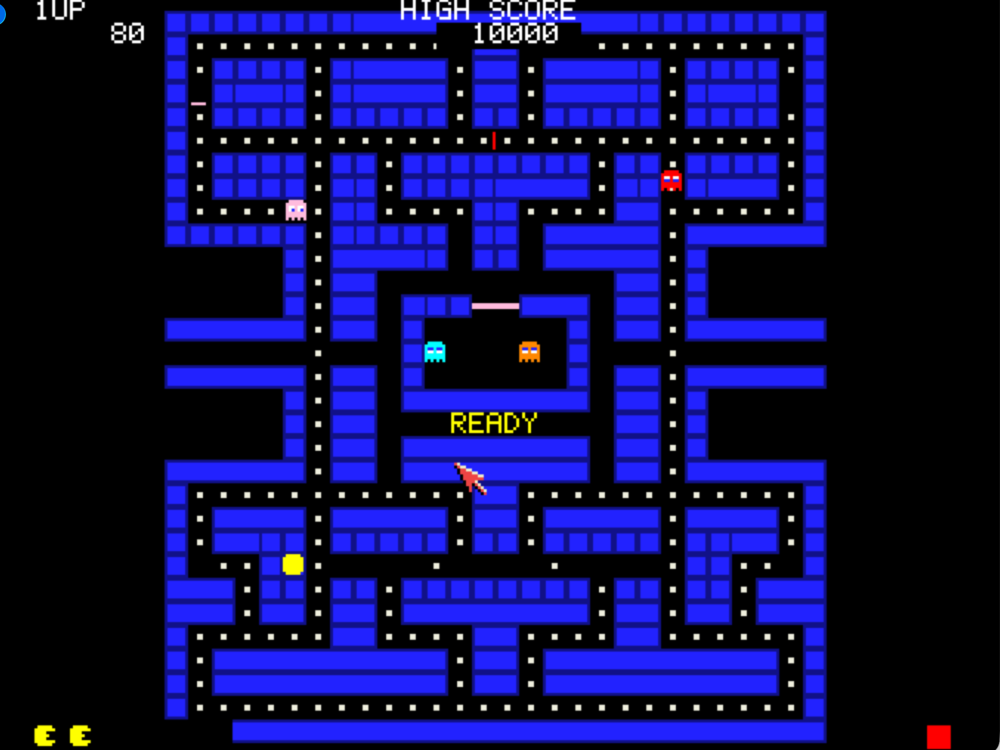
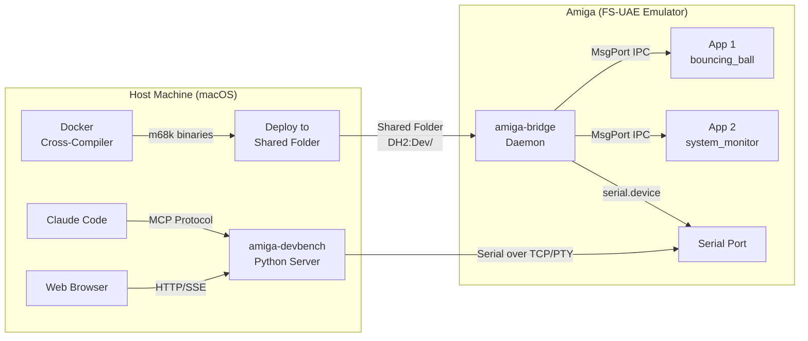

<!-- SPDX-License-Identifier: MIT -->
<!-- Copyright (c) 2026 Chris Collins <chris@hitorro.com> -->

# Examples and programming guide

[Documentation index](README.md) · [Install DevBench](quickstart.md)

## Overview

Traditional Amiga development is painful: no source-level debugger on the target,
no network stack on stock machines, and crashes take down the entire OS. This
project solves that by bridging the gap between a modern development host and the
Amiga over a serial link.

**What it enables:**

- Write C code on macOS, cross-compile via Docker, deploy to emulator in one command
- Live-inspect memory, registers, tasks, libraries, and volumes on the running Amiga
- Register variables in your Amiga app and read/write them from the host in real-time
- Define "hooks" — functions the host can call into your running app remotely
- Launch, stop, and break Amiga programs from the host
- Execute arbitrary AmigaDOS scripts on the Amiga from the host
- Read and write files on the Amiga filesystem
- **Source-level debugger** — set breakpoints, step into/over, inspect registers and call stack
- Monitor everything through a web dashboard or Claude Code MCP tools
- Manage files, assigns, processes, and protection bits without touching the Amiga
- Verify deployments with CRC32 checksums, tail log files in real-time
- Full process lifecycle: launch, track, signal, and stop async processes

Before we go any further.  The purpose of this tool is to make the amazing amiga community productive with AI.  Here are some screenshots of games I clobbered together in an afternoon.  They are included as examples and as of publishing are terrible.  Go ahead make them better:

Frank the frog



Invaded



Moon kindalookaround



PacBro






---

## Programming Examples

### Minimal App — Hello World

```c
#include <proto/exec.h>
#include <proto/dos.h>
#include "bridge_client.h"

int main(void)
{
    if (ab_init("hello") != 0) {
        printf("Bridge not running\n");
        return 1;
    }

    AB_I("Hello from Amiga!");
    Delay(50);
    ab_cleanup();
    return 0;
}
```

**Build:** Link with `-lbridge -lamiga`

### Variables — Remote Monitoring

```c
#include <proto/exec.h>
#include <proto/dos.h>
#include "bridge_client.h"

static LONG score = 0;
static LONG lives = 3;
static char player_name[32] = "Player1";

int main(void)
{
    ab_init("game");

    /* Register variables — host can read and write these */
    ab_register_var("score", AB_TYPE_I32, &score);
    ab_register_var("lives", AB_TYPE_I32, &lives);
    ab_register_var("player_name", AB_TYPE_STR, player_name);

    while (lives > 0) {
        score += 10;

        /* Push updated values to host every 50 frames */
        if (score % 500 == 0) {
            ab_push_var("score");
            ab_push_var("lives");
            ab_heartbeat();
        }

        /* Check for host commands (GETVAR, SETVAR, etc.) */
        ab_poll();

        Delay(1);
    }

    AB_I("Game over! Score: %ld", (long)score);
    ab_cleanup();
    return 0;
}
```

The host can now:
- Read `score` with `GETVAR|score`
- Set `lives` with `SETVAR|lives|99`
- See values in the web dashboard or via MCP tools

### Hooks — Remote Function Calls

```c
#include <proto/exec.h>
#include <proto/dos.h>
#include "bridge_client.h"

static LONG difficulty = 1;

/* Hook: called by the host, runs on the Amiga */
static int hook_set_difficulty(const char *args, char *result, int bufSize)
{
    if (args && args[0]) {
        difficulty = strtol(args, NULL, 10);
        sprintf(result, "Difficulty set to %ld", (long)difficulty);
    } else {
        sprintf(result, "Current difficulty: %ld", (long)difficulty);
    }
    return 0;  /* 0 = success */
}

static int hook_reset(const char *args, char *result, int bufSize)
{
    difficulty = 1;
    strncpy(result, "Reset complete", bufSize - 1);
    return 0;
}

int main(void)
{
    BOOL running = TRUE;
    ab_init("game");

    ab_register_var("difficulty", AB_TYPE_I32, &difficulty);

    /* Register hooks — host can call these by name */
    ab_register_hook("set_difficulty",
                     "Set game difficulty (1-10)",
                     hook_set_difficulty);
    ab_register_hook("reset",
                     "Reset all settings",
                     hook_reset);

    while (running) {
        /* IMPORTANT: Do NOT call ab_log inside hooks!
         * The daemon is waiting for the hook reply. */
        ab_poll();

        if (SetSignal(0L, SIGBREAKF_CTRL_C) & SIGBREAKF_CTRL_C)
            running = FALSE;

        Delay(5);
    }

    ab_cleanup();
    return 0;
}
```

From Claude Code: `amiga_call_hook("game", "set_difficulty", "5")`
From Web UI: Hooks panel → Call

### Memory Regions — Named Memory Areas

```c
#include <proto/exec.h>
#include "bridge_client.h"

struct GameState {
    LONG x, y;
    LONG vx, vy;
    LONG score;
    LONG level;
};

static struct GameState state = {100, 50, 2, 1, 0, 1};

int main(void)
{
    ab_init("game");

    /* Register a named memory region the host can inspect */
    ab_register_memregion("gamestate",
                          &state, sizeof(state),
                          "Player position, velocity, score, level");

    /* ... game loop ... */

    ab_cleanup();
    return 0;
}
```

The host can read the raw bytes of `gamestate` at any time for low-level inspection.

### Full Example — Bouncing Ball (excerpts)

```c
/* Register settable variables */
static LONG ball_speed = 1;
static LONG ball_color = 3;

ab_register_var("ball_speed", AB_TYPE_I32, &ball_speed);
ab_register_var("ball_color", AB_TYPE_I32, &ball_color);

/* Main loop uses the variables */
while (running) {
    draw_ball(rp, ball_x, ball_y, (UBYTE)ball_color);
    ball_x += dx;
    ball_y += dy;

    /* Push updates periodically */
    if (frame_count % 60 == 0) {
        ab_push_var("ball_speed");
        ab_push_var("ball_color");
        ab_heartbeat();
    }

    ab_poll();  /* Always poll! */
    Delay(ball_speed < 1 ? 1 : ball_speed);
}
```

Change the ball color from the web UI by editing `ball_color`, or from
Claude Code with `amiga_set_var("ball_color", "1")`.

### AmigaOS C Gotchas

| Gotcha | Fix |
|---|---|
| `sprintf` returns `char*`, not `int` | Use `strlen()` after if you need length |
| `%d` reads 16-bit WORD | Always use `%ld` with `(long)` cast |
| `%x` reads 16-bit WORD | Always use `%lx` with `(unsigned long)` cast |
| `%c` misaligns stack | Use `%s` with a 2-char string buffer |
| Default stack is 4KB | Make large buffers `static` |
| No memory protection | Buffer overflow crashes the entire OS |
| `Forbid()/Permit()` imbalance | Freezes system permanently |
| `WaitPort()` blocks forever | Use polling with timeout instead |

---
