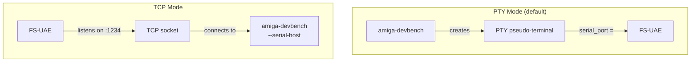

<!-- SPDX-License-Identifier: MIT -->
<!-- Copyright (c) 2026 Chris Collins <chris@hitorro.com> -->

# Emulator and hardware targets

[Documentation index](README.md) · [Install DevBench](quickstart.md)

The examples below describe specific setups. For a new installation, start
with the [checkout installation guide](quickstart.md) and use your own paths
and a separate local configuration.

## Deployment Topologies

DevBench talks to the bridge over a byte stream. What sits at the other end of
that stream is a deployment choice — three well-supported shapes:

| Profile | Transport | Bridge process runs in | Amiga TCP stack |
|---|---|---|---|
| `local-fsuae` | PTY symlink | FS-UAE on this host | n/a (byte stream is the PTY) |
| `real-amiga` | TCP on the LAN | A real Amiga (Amiberry / stock 68k iron) | RoadShow / AmiTCP (`bsdsocket.library`) |
| `pi-amikit` | TCP on the LAN | AmiKit inside Amiberry on a Raspberry Pi | Amiberry's built-in `bsdsocket_emu` |

All three run the **same** `amiga-bridge` binary; the only difference is the
transport argument you give it and where the process lives.

### Switching profiles

`devbench.toml` ships with all three predefined. Pick one:

```bash
# via config file
active_profile = "pi-amikit"

# via CLI (overrides active_profile in the config)
python -m amiga_devbench --profile local-fsuae
python -m amiga_devbench --profile real-amiga
python -m amiga_devbench --profile pi-amikit

# ad-hoc override without a profile
python -m amiga_devbench --mode tcp --serial-host 192.168.1.50 --serial-port 2345

# list what's defined
python -m amiga_devbench --list-profiles
```

Profile fields overlay on top of the flat `[serial]` / `[emulator]` sections
in `devbench.toml`, so shared defaults (`server_port`, `deploy_dir`, FS-UAE RPC
settings) stay in one place and each profile only sets what it needs to change.

### 1. `local-fsuae` — FS-UAE on this host, PTY transport

```toml
[profiles.local-fsuae]
mode = "pty"
pty_path = "/tmp/amiga-serial"
auto_start_emulator = true
```

FS-UAE side (`.fs-uae` config):
```ini
serial_port = /tmp/amiga-serial
```

Amiga side (`Startup-Sequence` or `User-Startup`):
```
Run >NIL: DH2:Dev/amiga-bridge          ; no args = serial mode
```

**Ordering matters:** devbench must start *before* FS-UAE (it creates the
symlink). This is the mode `[emulator] auto_start = true` handles.

### 2. `real-amiga` — real Amiga on the LAN, TCP transport

```toml
[profiles.real-amiga]
mode = "tcp"
host = "192.168.1.50"       # your Amiga's LAN IP
port = 2345
auto_start_emulator = false
```

Amiga side (needs a working TCP/IP stack — RoadShow, AmiTCP, Miami …):
```
Run >NIL: DH0:AmigaBridge/amiga-bridge TCP 2345
```

Confirm the stack is up with `ShowNetStatus` before starting the bridge.
On this topology **the Amiga listens** and devbench dials in.

### 3. `pi-amikit` — AmiKit inside Amiberry on a Raspberry Pi

```toml
[profiles.pi-amikit]
mode = "tcp"
host = "amiga.local"
port = 2345
# Optional: SSH-driven remote emulator control. When set, devbench uses
# RemoteEmulatorController — amiga_emulator_{status,start,stop,restart}
# MCP tools drive Amiberry over SSH. start escalates to `sudo reboot`
# if the ready probe never answers.
auto_start_emulator = true
emulator_ssh = "chris@amiga.local"
emulator_start_cmd = "sudo -u amikit env DISPLAY=:0 XAUTHORITY=/home/amikit/.Xauthority /home/amikit/Amiberry/amiberry -s use_gui no </dev/null >/dev/null 2>&1 & disown"
emulator_stop_cmd = "sudo pkill -f amiberry"
emulator_status_cmd = "pgrep -f amiberry >/dev/null"
emulator_ready_probe = "amiga.local:2345"
emulator_reboot_cmd = "sudo reboot"
```

Amiberry provides `bsdsocket_emu = true` in its `.uae` config — no RoadShow
install needed on the AmiKit side. The bridge runs on port 2345 just like the
real-Amiga case; devbench doesn't care which is on the other end.

**Deploy over the wire.** With this profile there is no shared folder between
the Mac and the Pi's AmigaOS, so `amiga_deploy` and `amiga_build_deploy_run`
automatically fall through to `file_transfer.push_file` (bridge WRITEFILE +
APPEND chunks, CRC32-verified). No config knob needed — the Deployer notices
`emulator_ssh` is set and forces the bridge path. The old
`amiga_serial_deploy` tool still works if you want to be explicit.

Amiga side (in AmiKit's `S:User-Startup`):
```
Run >NIL: SYS:AmigaBridge/amiga-bridge TCP 2345
```

**Bring-up shortcut** for this profile:

```bash
# 1. Push the current bridge binary + install script to the Pi
scp amiga-deploy/amiga-bridge  chris@amiga.local:/tmp/
ssh chris@amiga.local 'sudo mv /tmp/amiga-bridge \
    /home/amikit/AmiKit/AmigaBridge/amiga-bridge && \
    sudo chown amikit:amikit /home/amikit/AmiKit/AmigaBridge/amiga-bridge'

# 2. Reboot — Amiberry auto-starts, AmigaOS boots, User-Startup runs the bridge
ssh chris@amiga.local 'sudo reboot'

# 3. Point devbench at it
python -m amiga_devbench --profile pi-amikit

# 4. Smoke-test the wire
./scripts/smoke-bridge.sh
```

### Verifying the connection

`./scripts/smoke-bridge.sh` polls `/api/status` until `connected=true` and a
heartbeat has been observed. Works for all three modes since it only cares
that the wire is talking. `PORT` and `TIMEOUT` env vars tune it.

---

## FS-UAE Emulator Setup

### Configuration File

**Location:** `~/Documents/FS-UAE/Configurations/AmiKit-Debug.fs-uae`

```ini
[fs-uae]
# Kickstart ROM
kickstart_file = ~/Documents/FS-UAE/Kickstarts/kick.rom

# Hardware: A1200 with 68020+FPU, 2MB chip, 8MB fast
amiga_model = A1200
cpu = 68020
fpu = 68882
chip_memory = 2048
fast_memory = 8192

# Hard drives
hard_drive_0 = ~/Documents/FS-UAE/Hard Drives/System     # DH0: (boot)
hard_drive_1 = .../AmiKit/RabbitHole/InstalledOS          # DH1: (OS extras)
hard_drive_2 = .../AmiKit/Dropbox                         # DH2: (Dev binaries)

# Serial: TCP mode (devbench connects as client)
serial_port = tcp://0.0.0.0:1234
serial_on_demand = false

# Mouse: don't capture
mouse_integration = 1
automatic_input_grab = 0
initial_input_grab = 0
cursor_integration = 1

# Networking
bsdsocket_library = 1
```

### Startup Sequence

**Location:** `~/Documents/FS-UAE/Hard Drives/System/S/Startup-Sequence`

Key additions for the development environment:

```
; Suppress "Please insert Work" requester
Assign >NIL: Work: RAM:

; Auto-start bridge daemon
If EXISTS DH2:Dev/amiga-bridge
  Run >NIL: DH2:Dev/amiga-bridge
EndIf
```

### Connection Modes



**PTY mode:** devbench must start before FS-UAE (creates the PTY file)
**TCP mode:** FS-UAE must start before devbench (listens on port)

---
