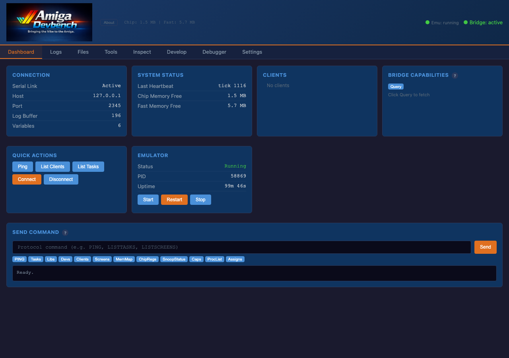
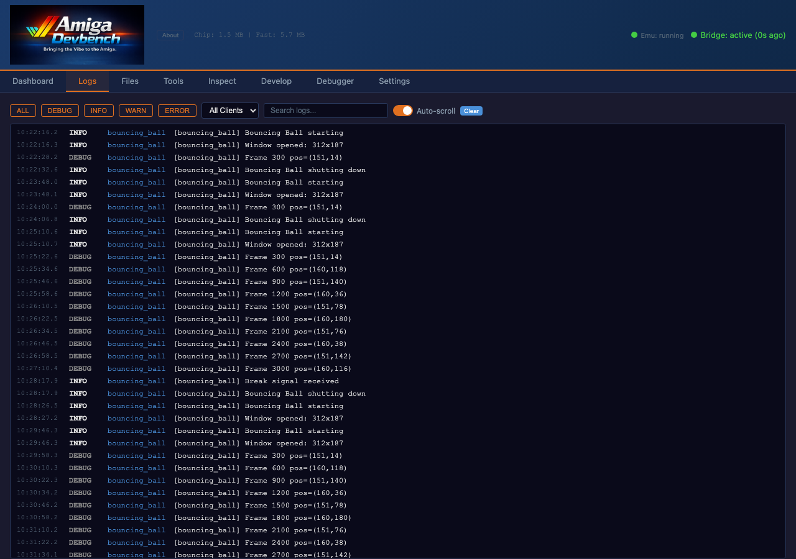
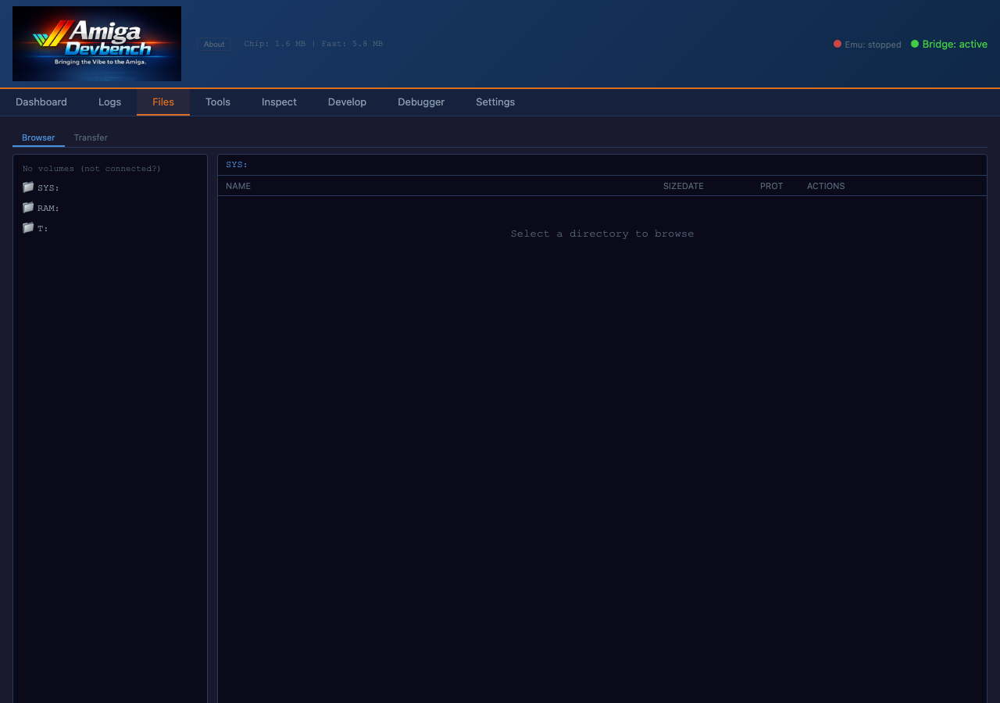
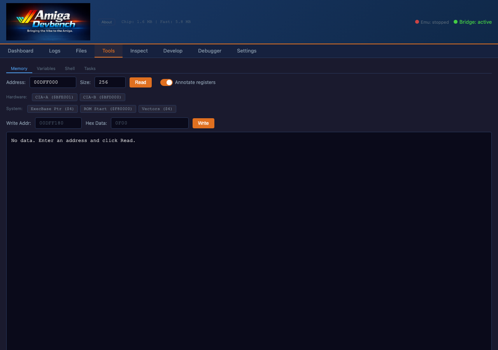
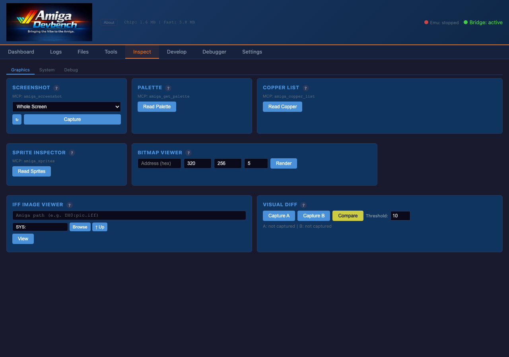
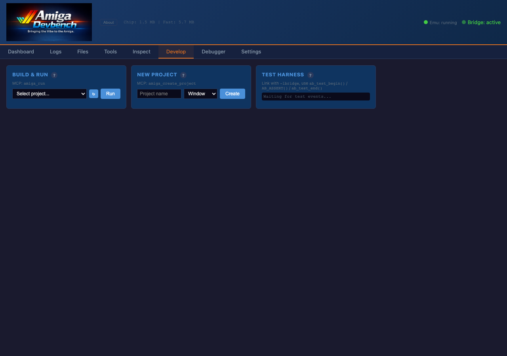
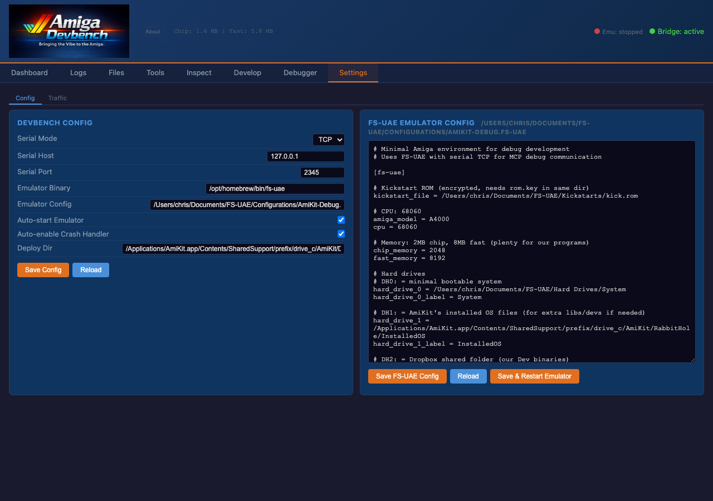
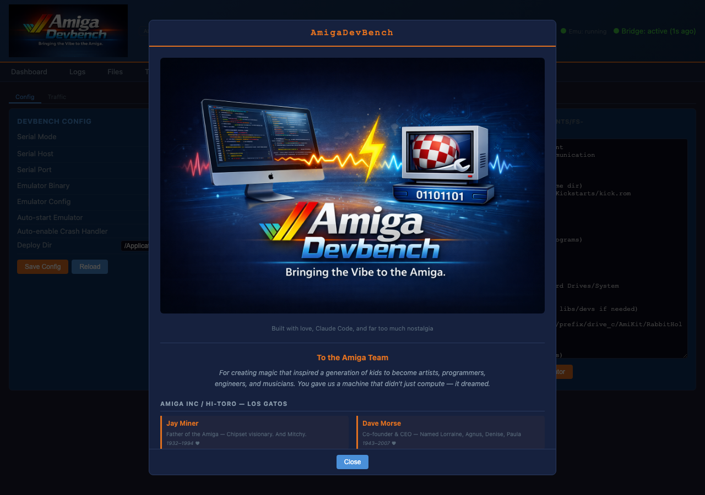
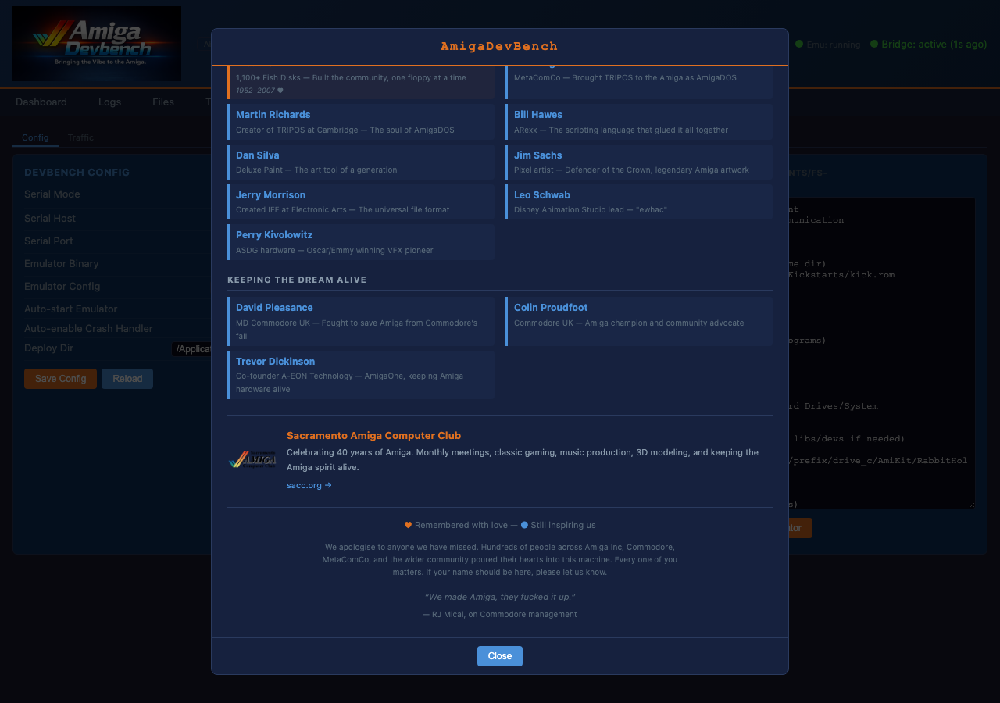
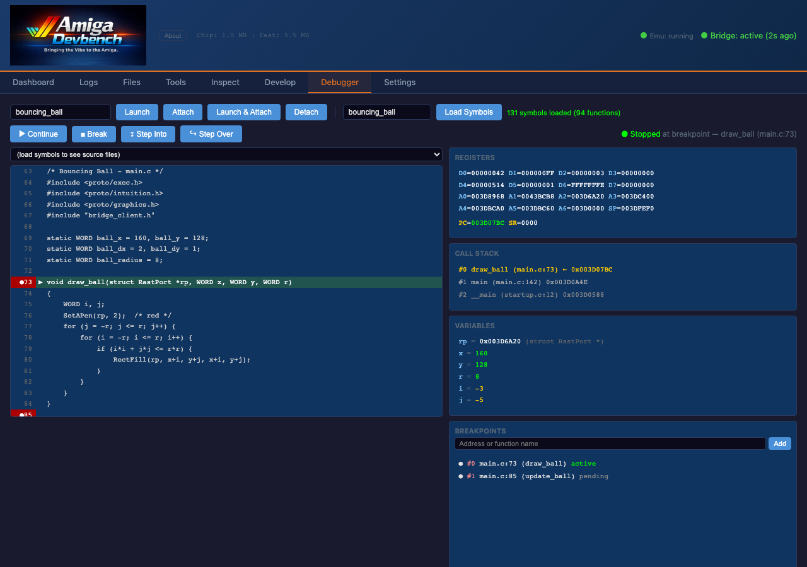

<!-- SPDX-License-Identifier: MIT -->
<!-- Copyright (c) 2026 Chris Collins <chris@hitorro.com> -->

# Web UI reference

[Documentation index](README.md) · [Install DevBench](quickstart.md)

## Web UI Reference

The web dashboard at `http://localhost:3000/` provides a real-time view
of the Amiga system with 8 main tabs.

### Dashboard

Connection status, system info, quick actions, and emulator control.



- **Connection card** — serial link state, host, port, buffer counts
- **System Status** — heartbeat, chip/fast memory, bridge version
- **Clients** — list of connected bridge clients
- **Bridge Capabilities** — queries daemon for supported commands
- **Quick Actions** — Ping, List Clients, Tasks, Libs, Screens, etc.
- **Emulator controls** — Start, Restart, Stop FS-UAE from the web UI
- **Send Command** — raw protocol command input

### Logs

Real-time log streaming from all Amiga bridge clients.



- Filter by level: DEBUG, INFO, WARN, ERROR (toggleable buttons)
- Filter by client name (dropdown)
- Text search (substring match)
- Auto-scroll toggle
- Color-coded by severity (blue=debug, green=info, orange=warn, red=error)

### Files

Amiga filesystem browser and host↔Amiga file transfer.



- **Browser sub-tab** — Volume browser (left pane), file listing (right pane), breadcrumb navigation
- **Transfer sub-tab** — Upload/download files, transfer history with CRC32 verification

### Tools

Four sub-tabs for memory, variables, shell, and tasks.

#### Memory


- Address input (hex) + Size input (decimal)
- Hardware/system bookmarks: CIA-A, CIA-B, ExecBase, ROM, Vectors
- Hex dump display with ASCII annotation
- **Write controls** — Address input, Hex Data input, Write button

#### Variables


- All registered variables from all clients
- Inline edit — click Edit, type new value, press Enter or click Set
- Auto-refresh toggle (3-second interval)

#### Shell


Remote AmigaDOS shell via the `shell_proxy` bridge client.

- **Launch Shell Proxy** button — builds, deploys, and starts the shell proxy on the Amiga
- Terminal-style interface with scrolling output (green text on dark background)
- Type AmigaDOS commands (`dir`, `type`, `list`, `assign`, etc.) and see output in real-time
- Arrow keys (Up/Down) navigate command history
- Aliases: define named shortcuts, persisted server-side

#### Tasks


- All running tasks/processes with Name, Priority, State, Type columns
- Refresh button + auto-refresh toggle (5-second interval)
- Tracked processes panel for launched programs

### Inspect

Three sub-tabs for graphics, system, and debug tools.





#### Inspect Tools
Visual inspection and development tools arranged in a grid. Each tool has a `?` tooltip with detailed help.

**Screenshot** — Captures the Amiga display as PNG. Select a window from the dropdown or choose "Whole Screen" for the frontmost screen. Reads planar bitplane data from chip RAM and converts to chunky pixels on the host. Screenshots saved to `/tmp/amiga-screenshots/` with clickable preview links and history.

**Palette** — Reads the OCS/ECS 12-bit color palette from the frontmost screen's ColorMap via `GetRGB4()`. Displays color swatches with hex values. Workbench uses 4 colors; custom screens up to 32 (5 bitplanes) or 256 (AGA).

**Copper List** — Reads and decodes the copper list from `GfxBase->ActiView->LOFCprList`. Shows each 4-byte instruction: MOVE (write to custom chip register with named register), WAIT (wait for beam position), or SKIP. Spans 2 grid columns for readability.

**Sprite Inspector** — Reads the 8 hardware sprite channels by scanning the copper list for SPRxPT register writes and checking `GfxBase->SimpleSprites[]` for Intuition-managed sprites (mouse pointer). Shows position, size, and attach mode.

**Disassembler** — Reads memory from the Amiga and disassembles 68000 machine code. Enter a hex address and instruction count. Supports all 68k addressing modes and annotates known Exec/DOS/Intuition/Graphics library calls (LVOs). Spans 2 grid columns. Try `$FC0000` for Kickstart ROM.

**Crash Report** — Intercepts guru meditations by patching `exec.library Alert()` via `SetFunction()`. Not installed by default — click **Enable** to activate, **Disable** to remove. When a crash occurs, captures alert code, alert name, all 16 registers (D0-D7, A0-A7), stack pointer, and 64 bytes of stack data. Click **Test** to trigger a recoverable alert.

**Resource Tracker** — Queries a bridge client's tracked resources. Select a client from the dropdown. Apps using `ab_track_alloc()`/`ab_track_free()` and `ab_track_open()`/`ab_track_close()` report allocations and open handles. Shows leaked resources.

**Performance Profiler** — Queries a bridge client's performance data. Select a client from the dropdown. `ab_perf_frame_start()`/`ab_perf_frame_end()` tracks frame timing (avg/min/max). `ab_perf_section_start()`/`ab_perf_section_end()` measures named code sections. Uses `VHPOSR ($DFF006)` for ~64us precision.

**Memory Search** — Search Amiga memory for a hex byte pattern. Enter a start address (hex), search length (bytes), and hex pattern (e.g., `4AFC` to find ILLEGAL instructions). Returns up to 32 matching addresses. Validates the start address is in accessible RAM before scanning.

**Bitmap Viewer** — Render a region of Amiga memory as a bitmap image. Specify address, width, height, and bit depth (1-8 planes). Interprets data as Amiga planar bitplane format and renders with the current or default palette. Useful for inspecting graphics data, sprite sheets, or screen buffers in chip RAM.

**Memory Map** — Shows all memory regions from `ExecBase->MemList`. For each region: name, attributes (CHIP/FAST), address range (lower–upper), total free bytes, and largest contiguous block. Walks the `MemChunk` free list for accurate free space reporting. Essential for tracking memory fragmentation.

**Stack Monitor** — Inspect stack usage for any running task. Select a task from the dropdown (auto-populated from the task list) and click Check. Shows SP register value, stack bounds ($SPLower–$SPUpper), total stack size, bytes used, and bytes free. A color-coded progress bar highlights danger levels: green (<60% used), yellow (60–80%), red (>80%). Amiga's default 4KB stack is a common crash source.

**Register Viewer** — Captures the CPU register state of the bridge daemon process. Shows all 16 data/address registers (D0–D7, A0–A6) and the stack pointer (SP) as 32-bit hex values. Note: values reflect the register state at capture time inside the handler function, not the caller's exact state. SR (status register) requires supervisor mode on 68010+ and is not readable from user mode.

**Chip Register Viewer** — Reads all safe (read-only) custom chip registers at $DFF000. Displays a table with register name, address, raw hex value, and decoded bitfields. Includes: DMACONR, VPOSR, VHPOSR, JOY0DAT, JOY1DAT, CLXDAT, ADKCONR, POT0DAT/POT1DAT, POTGOR, SERDATR, DSKBYTR, INTENAR, INTREQR, and DENISEID. Write-only registers are excluded to avoid side effects. Spans 2 grid columns.

**IFF Image Viewer** — View IFF ILBM images stored on the Amiga filesystem. Browse files using the built-in file browser widget (same navigation as the Files tab). Clicking an IFF/ILBM file reads it from the Amiga, decodes the FORM/BMHD/CMAP/BODY chunks on the host (including ByteRun1 decompression), converts planar data to a PNG, and displays it inline. IFF files are highlighted in green in the browser.

**Diff/Snapshot** — Compare memory state over time. Take a named snapshot of a memory region, then take another snapshot later and diff them to see what changed. Actions: **Take** (save address+size as a named snapshot), **Diff** (compare two snapshots byte-by-byte, shows changed offsets), **List** (show all saved snapshots), **Clear** (delete all snapshots). Useful for tracking memory corruption or understanding how game state evolves.

**Boot Log** — Shows the earliest log messages captured during this devbench session. Displays the first N log entries received over the serial link, which typically include bridge daemon startup messages and early client registrations. If devbench was started before the bridge, these represent the true boot sequence.

**Library / Device Inspector** — Browse all loaded libraries and devices on the Amiga. Two tabs (Libraries / Devices) each show a clickable list populated from `exec.library`'s `LibList` and `DeviceList`. Click any entry to see detailed info: name, version.revision, open count, flags, negative size (jump table), positive size (data area), base address, and ID string. From the detail view:
- **Show Jump Table** — lists every LVO entry in the library's jump table with its target address, paginated (60 per page). Each LVO is a 6-byte JMP instruction at a negative offset from the library base.
- **Dump Base Memory** — reads raw memory at the library base address and opens it in the Disassembler panel for inspection.
- **Dump Jump Table** — reads the negative-offset region (the actual jump table bytes) and opens it in the Disassembler.

Useful for finding library versions, checking if a library is loaded, and reverse-engineering library entry points.

**SnoopDos** — Real-time system call monitoring, inspired by the classic SnoopDos utility. Uses `SetFunction()` to patch 10 functions in `exec.library` and `dos.library`:
- **exec.library**: `OpenLibrary`, `CloseLibrary`, `OpenDevice`, `CloseDevice`
- **dos.library**: `Open`, `Close`, `Lock`, `UnLock`, `LoadSeg`, `UnLoadSeg`

Click **Start** to install patches, **Stop** to remove them. While active, every call to a patched function is logged to a ring buffer on the Amiga side and streamed to the host at 200ms intervals. The log table shows: function name, caller address, arg1 (file path, library name, or BPTR address), arg2 (mode, version, etc.), result (OK/FAIL), and tick count. Status bar shows total event count, drop count (ring buffer overflow), and buffered count. The log is capped at 500 entries with rendering throttled for performance.

**Assign Manager** — View, create, modify, and remove AmigaOS logical assigns. The list shows all current assigns with their target paths. Use the input fields to create new assigns or click the red `x` to remove one. Supports the ADD checkbox for multi-directory assigns. Uses the `SCRIPT` command to run `assign` on the Amiga.

**Startup-Sequence Editor** — Remotely edit `S:Startup-Sequence`, `S:User-Startup`, or `S:Shell-Startup`. Select a file from the dropdown, click **Load** to read it into the editor, make changes, and click **Save** to write it back. Changes take effect on next Amiga boot.

**Preferences Editor** — Browse Workbench preferences files stored in `ENV:sys/`. Click **List Prefs** to see available `.prefs` files with sizes, then click any entry to view its contents (IFF binary format shown as hex).

**Custom Chip Logger** — Monitor readable custom chip registers for changes. Click **Start** to begin polling 13 registers (DMACONR, INTENAR, INTREQR, JOY/POT data, etc.) at 200ms intervals. Register changes appear in real-time. Click **Snapshot** for a one-shot read. Click **Stop** to end monitoring.

**Memory Pool Tracker** — Track pool-based memory allocation. **Start** patches `CreatePool`/`DeletePool`/`AllocPooled`/`FreePooled` in `exec.library` via `SetFunction()`. **Refresh** shows active pools with allocation counts, free counts, and total sizes. **Stop** restores original function vectors. Tracks up to 32 pools.

**Visual Diff** — Compare two Amiga screenshots to find pixel differences. Click **Capture A** for a baseline, make changes on the Amiga, click **Capture B**, then **Compare**. Produces a diff image highlighting changed regions in magenta with yellow bounding boxes. Adjustable threshold (0-255) controls sensitivity. Reports change percentage and number of changed regions.

**Font Browser** — Enumerate installed Amiga fonts. Click **List Fonts** to query `diskfont.library` via `AvailFonts()`. Shows font families grouped with available sizes. Click any font entry to view detailed metrics: baseline, x/y size, style flags, and font type. Located in the Inspect sub-tab.

**Locale/Catalog Inspector** — Browse installed locale catalogs under `LOCALE:Catalogs/`. Click **List Catalogs** to see available catalog directories. Click a directory to see its contents (catalog files with sizes). Located in the Inspect sub-tab.

**Clipboard Bridge** — Share clipboard text between host and Amiga. **Get from Amiga** reads IFF FTXT data from `clipboard.device`. **Set on Amiga** writes text to the Amiga clipboard. **Copy to Host** copies the displayed text to the host system clipboard. Located in the Control sub-tab.

**System Info Dashboard** — One-click system overview combining multiple queries. Shows free chip RAM, free fast RAM, number of connected bridge clients, loaded library count, running task count, and mounted volume count. Provides a quick health check of the Amiga system state.

### Develop

Build, deploy, and run Amiga programs from the browser.



**Build & Run** — Full development cycle in one click: cross-compile via Docker (using a persistent container for ~10x speedup), deploy binary to AmiKit shared folder, stop any running instance (CTRL-C), then launch. Select a project from the dropdown (populated from the `examples/` directory).

**New Project** — Scaffolds a new example project with Makefile and main.c. Three templates:
- **Window** — Intuition window on the Workbench screen with bridge integration
- **Screen** — Custom screen (320x256, 5 bitplanes) with bridge integration
- **Headless** — CLI-only program with bridge hooks, no GUI

**Test Harness** — Real-time test results from `AB_ASSERT()` macros in client code.

### Settings

Serial, emulator, server configuration, and MCP/REST traffic logging.



- **Config sub-tab** — Serial mode (TCP/PTY), host, port, emulator binary/config path, auto-start, deploy directory. All editable and saved to `devbench.toml`.
- **Traffic sub-tab** — Request logging with filters (MCP/REST), search, timing analysis for debugging MCP tool performance.

### About Dialog



Click the logo or "About" button to view the tribute to the Amiga team, the Sacramento Amiga Computer Club (SACC), and project credits.



The About dialog includes a tribute to the [Sacramento Amiga Computer Club](https://sacc.org/) — 40 years of Amiga community with monthly meetings, classic gaming, music production, and 3D modeling.

### Tab Organization

The web UI is organized into 9 main tabs (the **FS-UAE** tab only appears when the patched fs-uae build is detected — see [Two debuggers](debuggers.md#two-debuggers-when-to-use-which)):

| Tab | Backend | Sub-tabs | Purpose |
|-----|---------|----------|---------|
| **Dashboard** | bridge | — | Connection status, system info, quick actions, emulator control |
| **Logs** | bridge | — | Real-time log streaming with level/client/text filtering |
| **Files** | bridge | Browser, Transfer | Amiga filesystem navigation, host↔Amiga file transfers |
| **Tools** | bridge | Memory, Variables, Shell, Tasks | Memory inspection, variable editing, AmigaDOS shell, task list |
| **Inspect** | bridge | Graphics, System, Debug | Screenshots, palettes, copper lists, sprites, SnoopDos, input injection |
| **Develop** | host | — | Build & Run, New Project scaffolding, Test Harness |
| **Debugger** | **bridge** (serial / Amiga daemon) | — | Source-level debugging — breakpoints by file:line, locals, call stack |
| **FS-UAE** | **fs-uae HTTP RPC** (patched build only) | CPU & Breakpoints, Memory, Chipset, State & Symbols | Emulator-level CPU debugger — hardware watchpoints, ROM inspection, chipset snapshot |
| **Settings** | host | Config, Traffic | Serial/emulator/server config, MCP/REST request logging |

The "Backend" column tells you whether the tab requires the Amiga bridge daemon to be running (`bridge`), the patched fs-uae build (`fs-uae HTTP RPC`), or just devbench itself (`host`).

### Debugger Tab



The Debugger tab provides source-level debugging for Amiga programs, communicating
with the bridge daemon's built-in debugger which uses 68k exception handlers.

#### Target & Launch Controls
- **Target** dropdown — select a project from `examples/` to debug
- **Build & Launch** — cross-compile, deploy, and launch with debug symbols loaded
- **Load Symbols** — parse the ELF/Hunk binary to extract function names and source line mappings
- **Attach/Detach** — connect to or disconnect from a running program's debug session

#### Execution Controls
When the target is stopped (breakpoint hit, stepped, or manually broken):

| Button | Action | Description |
|--------|--------|-------------|
| **Continue** | Resume | Run until next breakpoint or manual break |
| **Break** | Stop | Pause execution at current instruction |
| **Step Into** | Single step | Execute one instruction, entering function calls |
| **Step Over** | Step over | Execute one instruction, stepping over function calls |

#### Source Viewer
- Displays the C source file corresponding to the current program counter
- **Gutter breakpoints** — click the line number gutter to toggle breakpoints (red dots)
- **Current line highlight** — the executing line is highlighted in yellow/green
- **Scroll to PC** — automatically centers the view on the current execution point
- Source files are read from the host project directory using debug symbol line mappings

#### Registers Panel
Shows all 68020 CPU registers when the target is stopped:
- **Data registers**: D0–D7 (32-bit hex values)
- **Address registers**: A0–A6 (32-bit hex values)
- **Stack Pointer**: SP/A7
- **Program Counter**: PC with current address
- **Status Register**: SR with condition code flags

#### Call Stack (Backtrace)
- Shows the function call chain from the current PC back to `main()`
- Each frame shows: function name, source file, line number, and return address
- Click a frame to navigate the source viewer to that location
- Uses frame pointer (A5) chain walking + symbol table lookups

#### Breakpoints Panel
- Lists all set breakpoints with source file, line number, and address
- Toggle enable/disable per breakpoint
- Delete individual breakpoints or clear all
- Breakpoints persist across continue/step operations
- Implemented via 68k TRAP instructions patched into the code

#### Variables Panel (Debug Context)
- When stopped, shows local variables and function parameters
- Values read from the Amiga's memory using debug symbol information
- Changed values highlighted since last stop

#### How It Works
The bridge daemon's debugger module (`debugger.c`) installs 68k exception handlers:
1. **TRAP #0** — breakpoint exception. When a breakpoint address is hit, the CPU traps, registers are saved, and the bridge notifies the host.
2. **Trace bit** — for single-stepping. Sets the T bit in the SR to generate a trace exception after each instruction.
3. The host sends **BREAK**, **CONTINUE**, **STEP**, **STEPOVER** commands via the serial protocol.
4. Register state is captured in the exception handler and sent as **DBGSTOP** events.
5. **Step Over** detection: compares the stopped PC against known function entry points to determine if we entered a call, and sets a temporary breakpoint at the return address.

### FS-UAE Tab

Appears only when devbench detects the patched fs-uae build (header shows green "RPC: live" badge). See [Two debuggers](debuggers.md#two-debuggers-when-to-use-which) for when to use this vs the Debugger tab.

The tab has a banner at the top reminding you which backend it talks to (`fs-uae HTTP RPC`), and a shared toolbar across all sub-tabs:

| Control | Effect |
|---|---|
| ■ Pause / ▶ Resume | Stop / resume the emulator |
| ↓ Step / ↓×100 | Step 1 or 100 CPU instructions |
| Step Over | Run JSR/BSR to completion, re-pause at the next instruction |
| Step Out | Run until the current function returns |
| Hard Reset / Soft Reset | Power-on (RAM clear) or CTRL+A+A equivalent |
| State / PC display | Live emulator state + program counter |
| ↻ Refresh | Re-read CPU + state + BP/WP lists |

#### Sub-tab: CPU & Breakpoints
- **Disassembly** (left, ~55%): enter address and count, optionally annotate JSR/JMP `-$xxx(A6)` calls with their library function names (e.g. `exec.OpenLibrary()`).
  - **Source xref** checkbox: when on, devbench cross-references each disassembled address against the symbols loaded in the bridge Debugger tab. If a match is found, the source file + line number is shown beneath each instruction (`↳ funcName  myfile.c:123`). Useful for "where in my code is this fs-uae-level instruction?". A project picker appears when source xref is enabled, in case you have multiple projects' symbols loaded.
- **CPU Registers** (top-right): all 18 regs (D0-D7, A0-A7, PC, SR, USP, ISP). Click any value to inline-edit.
- **Breakpoints (CPU)**: address + skip-count (silently ignore the first N hits) + one-shot toggle. Up to 20 active. Works on Kickstart ROM.
- **Watchpoints (MEM)**: hardware-style watchpoints — address + size (bytes) + R/W/I + `mustchange` (skip writes-of-same-value). "Last hit" line shows the triggering PC + value the moment a WP fires.

#### Sub-tab: Memory
- **Hex viewer**: read up to 64KB from any address via fs-uae's debug memory accessor (works on Kickstart ROM and during early boot — unlike the bridge-based memory tool).
  - **Format selector**: `bytes` (16/row + ASCII), `words` (8 big-endian words/row), `longs` (4 big-endian longwords/row, **clickable to follow pointer**), `ASCII` (32 chars/row).
  - **← Back button**: navigation history — every pointer-follow pushes the previous address on a stack.
- **Memory writer**: write hex bytes to any address (pause first; writes to unmapped/ROM regions silently no-op — check the memory map first).
- **Memory map** (right): per-region table with kind (chipram / ram / rom / io / cia / unmapped) and label. Useful before issuing a write.
- **Stack walk**: read N longwords from `(A7)` upward with `code` / `data` heuristic tagging — candidate return-address chain for manual stack walking on m68k.

#### Sub-tab: Chipset
- One-click snapshot of all Amiga custom registers, grouped by area: DMA/Interrupts (DMACON, INTENAR, INTREQR), Bitplane/Display (BPLCON0-3, DDFSTRT/STOP, DIWSTRT/STOP), Bitplane pointers (BPL1-6PT), Copper (COP1/2LC, COPJMP), Beam position (VPOSR, VHPOSR). Pause first for stable read.

#### Sub-tab: State & Symbols
- **Snapshot slots** (1–9): quick-save / quick-load to numbered `.uss` files under `~/.amiga-devbench/snapshots/`. Shows size + last-saved time per slot.
  - **Keyboard shortcuts on the FS-UAE tab**: press `1`–`9` to load that slot; `Shift+1`–`Shift+9` to save into it.
- **Custom path** save/load — for paths outside the slot dir.
- **Snapshot diff**: pick two snapshots from the dropdowns and click Diff. Chunk-level diff via `fsuae_remote_patch/tools/uss_diff.py` if available (searched in `~/.amiga-devbench/`, `~/code/`, and a few known locations); falls back to a byte-summary if not. Output shows which `.uss` chunks differ.
- **Symbol lookup**: look up any address against fs-uae's built-in table (~140 entries) — chipset registers (DFFxxx), CIA-A/B (BFExxx), 68k exception vectors.
- **FD library offset lookup**: translate a negative offset (e.g. `-552`) into the library function name (`exec.RawDoFmt`). Defaults to exec; specify another loaded library if needed.
- **FD library management**: list loaded FD tables, and load arbitrary `.fd` files from disk (e.g. `graphics.fd`, `intuition.fd`) so the disassembler can annotate `JSR -$xxx(A6)` calls into those libraries.

#### Push notifications (WebSocket-driven)

Devbench connects to fs-uae's `/v1/events` WebSocket as soon as the RPC goes live and republishes every frame onto its own SSE bus as `fsuae_event`. The UI listens for these and:

- Refreshes CPU registers + disassembly + breakpoint/watchpoint lists automatically when the emulator pauses (no need to hit Refresh).
- Flashes the FS-UAE tab amber for 5s on `wp_hit` (watchpoint fire) and `auto_paused` (bridge crash → auto-pause).
- Surfaces the auto-pause reason in the State sub-tab status line.

Event types seen on the bus:

| Event | Source | Meaning |
|---|---|---|
| `hello` | fs-uae | Sent on WS connect. Confirms the push channel is live. |
| `paused` | fs-uae | Emulator stopped (user pause, breakpoint, watchpoint, step complete). Includes `pc`, `reason`, optional `bp_slot` / `bp_hits`. |
| `running` | fs-uae | Emulator resumed. |
| `wp_hit` | fs-uae | A watchpoint fired (in addition to the `paused` event). |
| `ws_connected` | devbench | Synthetic — devbench established the WS connection. |
| `ws_disconnected` | devbench | Synthetic — devbench lost the WS connection (will reconnect with backoff). |
| `auto_paused` | devbench | Synthetic — devbench paused fs-uae because the bridge reported a crash. Carries `reason`, `alertNum`, `pc`. |

#### Auto-pause on bridge crash

When the Amiga bridge reports a crash (Guru alert, access fault, etc.), devbench can automatically pause fs-uae so the CPU state is frozen at the fault moment for inspection — instead of fs-uae continuing past the alert and overwriting state.

Controlled by `[fsuae_rpc] auto_pause_on_crash = true` in `devbench.toml` (default on). When it triggers, an `auto_paused` event is published with the alert number and PC for context.

#### Auto-snapshot ring buffer (opt-in)

**Off by default.** When enabled, devbench saves a `.uss` snapshot to a rotating ring every N seconds — letting you "rewind" by loading an earlier snapshot. Approximates reverse-continue for forensic debugging.

Performance: each save is ~19MB and takes ~100-300ms, **stalling the emulator briefly**. Don't leave this on during normal sessions. Configure via:

```toml
[fsuae_rpc]
auto_snapshot_interval_s = 0     # 0 = off (default). Set to e.g. 30 for snap-every-30s
auto_snapshot_ring_size = 5      # rotating slots auto-0.uss .. auto-4.uss
```

Or toggle at runtime from the **State & Symbols** sub-tab → "AUTO-SNAPSHOT RING" panel, or via `POST /api/fsuae/snapshot/autosnap/set?interval=30&ring_size=5`. Disable with `interval=0`.

#### Symbolic breakpoints from bridge symbols

Set a fs-uae CPU breakpoint by **function name** instead of address — uses symbols loaded by the bridge Debugger tab.

```sh
# 1. Load symbols (in Debugger tab or via MCP amiga_load_symbols)
# 2. Set BP by name:
curl -X POST 'http://localhost:3000/api/fsuae/breakpoints/by-symbol?name=draw_ball'
# {"ok":true,"slot":0,"addr":"0x00020e08","symbol":"draw_ball","resolved_project":"bouncing_ball",...}
```

Or via MCP: `amiga_fsuae_breakpoint_by_symbol("draw_ball")`. Or in the UI: the BP form on the CPU & Breakpoints sub-tab has a new **+ BP @symbol** button alongside the address one. Zero ambient cost — pure translation invoked only on user action.

### SSE Event Stream

The web UI connects to `/api/events` for real-time updates:

| Event | Data | Updates |
|---|---|---|
| `log` | `{level, tick, message, client}` | Logs panel |
| `heartbeat` | `{tick, freeChip, freeFast}` | Status header |
| `var` | `{name, varType, value, client}` | Variables panel |
| `status` | `{connected, logCount, varCount}` | Connection status |
| `clients` | `{names: [...]}` | Client list |
| `tasks` | `{tasks: [...]}` | Tasks panel |
| `snoop` | `{func, caller, arg1, arg2, result, tick}` | SnoopDos event log |
| `snoopstate` | `{active, eventCount, dropCount, buffered}` | SnoopDos status |
| `fonts` | `{count, fonts: [...]}` | Font enumeration response |
| `fontinfo` | `{name, size, ysize, xsize, style, flags, baseline}` | Font metrics response |
| `chiplog` | `{registers: {name: value, ...}}` | Chip register snapshot |
| `chiplogchange` | `{tick, changes: {reg: {old, new}, ...}}` | Chip register change notification |
| `pools` | `{count, pools: [...]}` | Pool tracker data |
| `clipboard` | `{length, text}` | Clipboard content response |
| `libinfo` | `{name, version, revision, openCnt, ...}` | Library detail response |
| `devinfo` | `{name, version, revision, openCnt, ...}` | Device detail response |
| `libfuncs` | `{name, page, totalPages, entries: [...]}` | Library jump table entries |
| `capabilities` | `{version, protocolLevel, maxLine, commands}` | Daemon capabilities response |
| `proclist` | `{count, processes: [{id, command, status}]}` | Tracked process list |
| `procstat` | `{id, command, status}` | Single process status |
| `taildata` | `{path, data}` | New data appended to tailed file |
| `checksum` | `{path, crc32, size}` | File checksum response |
| `assigns` | `{count, assigns: [{name, path, assignType}]}` | Assign list response |
| `protect` | `{path, bits}` | Protection bits response |
| `connected` | `{}` | Status indicator → green |
| `disconnected` | `{}` | Status indicator → red |
| `emulator_status` | `{running, pid, uptime, binary, configured_binary, patched, config}` | Header emulator dot + FS-UAE tab visibility |
| `fsuae_rpc_status` | `{status, enabled, host, port, base_url, service, last_probe, last_error}` | Header RPC badge + FS-UAE tab availability |
| `fsuae_event` | `{event, ...}` — pushed from fs-uae's `/v1/events` WebSocket. Events: `hello`, `paused`, `running`, `wp_hit`, `auto_paused` (synthetic), `ws_connected` / `ws_disconnected` (synthetic) | FS-UAE tab auto-refresh on paused; flash tab amber on wp_hit / auto_paused |

---
